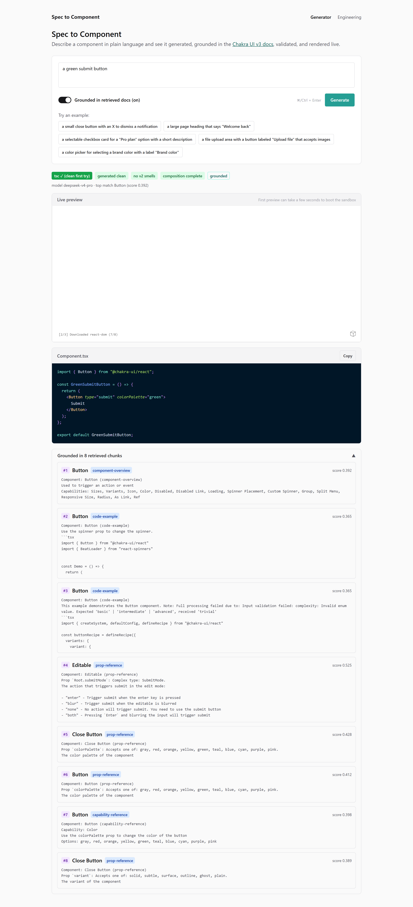
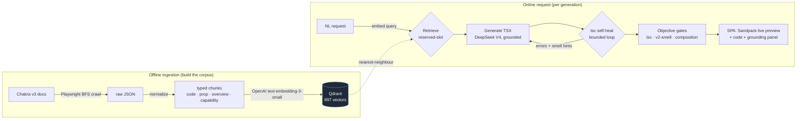
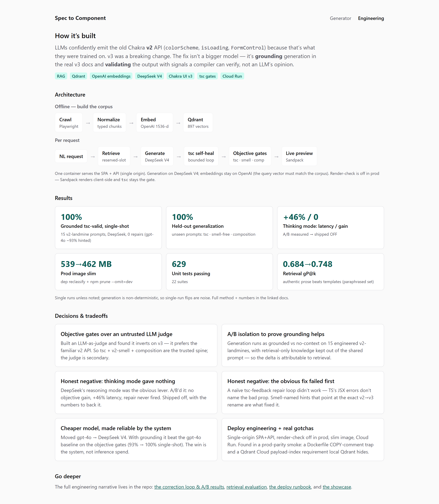

# Spec to Component

**Describe a UI component in plain English and get a grounded, type-checked, live-rendered Chakra UI
v3 component.** A RAG pipeline retrieves the real v3 documentation, a model generates the component,
and objective validators gate the result, so the output uses the *current* v3 API instead of the v2
API an LLM remembers.

`TypeScript` · `RAG` · `Qdrant` · `OpenAI embeddings` · `DeepSeek V4` · `React + Chakra UI v3` · `Sandpack` · `Docker` · `Cloud Run`

▶ **Live demo:** **https://spec-to-component-986872156950.us-central1.run.app**
_(Google Cloud Run; the free tier may cold-start on the first request after idle.)_



---

## The problem

Ask any LLM for a Chakra UI component and it confidently emits the **v2** API (`colorScheme`,
`isLoading`, `FormControl`, monolithic components) because that is what dominated its training data.
Chakra **v3** was a major breaking change (`colorPalette`, `loading`, slot-based composition like
`Field.Root` / `NumberInput.Root`). The result *looks* right, compiles in the model's head, and is
**wrong**.

The fix isn't a bigger model. It's **grounding** (retrieve the real v3 docs and put them in context)
plus **objective validation** (prove the output is correct with checks a compiler can confirm, not an
LLM's opinion).

## Highlights

- **RAG-grounded generation.** Retrieves real Chakra v3 doc chunks from Qdrant and generates a
  self-contained TSX component grounded in them.
- **Objective validation, not vibes.** Every generation is gated on three signals a compiler can
  verify: a `tsc` type-check (against the pinned `@chakra-ui/react@3.27.1`), a v2-smell lint, and a
  composition lint.
- **Bounded self-heal.** Feeds `tsc` diagnostics and smell hints back to the model until the component
  compiles or a cap is hit.
- **Cheaper model, made reliable by the system.** Generation runs on DeepSeek V4 (embeddings stay on
  OpenAI); with grounding it beats the gpt-4o baseline on the objective gates while costing less.
- **Live and deployed.** A Vite + Chakra v3 SPA with a Sandpack live preview, served with the API from
  a single Cloud Run container.
- **Measured, honestly.** Grounded-vs-no-context A/B, held-out generalization, and recorded *negative*
  results (DeepSeek "thinking mode" gave no objective gain at +46% latency).

## Architecture



**Deploy:** one container serves the SPA **and** `POST /api/generate` from a single origin (no CORS).
Generation runs on **DeepSeek V4**; **embeddings stay on OpenAI** (the query vector must match the
`text-embedding-3-small` corpus). The Chromium render-check is **off in prod** (small image); Sandpack
renders client-side and `tsc` stays the gate. Full runbook: **[README_DEPLOY.md](README_DEPLOY.md)**.

## How it works

The corpus is built offline: crawl the Chakra v3 docs, normalize each page into typed chunks (code
examples with their real prose, prop references, component overviews, capabilities), embed with
OpenAI, and store in Qdrant. At request time the natural-language prompt is embedded, the most relevant
chunks are retrieved (including a reserved slot for the target component's blueprint), and DeepSeek
generates a self-contained TSX component grounded in that context. A bounded self-heal loop feeds `tsc`
diagnostics plus v2-smell hints back to the model until it compiles or the cap is hit, then the three
objective gates score the final artifact. The SPA renders it live in a Sandpack sandbox and shows the
report plus the chunks it was grounded in.

## Engineering decisions & tradeoffs

The product is the easy part. These are the decisions worth talking through.

- **Objective gates over an untrusted LLM judge.** I built an LLM-as-judge and found it *inverts* on
  v3: it prefers the familiar v2 API and marks correct v3 as wrong. So the trusted spine is `tsc` +
  v2-smell + composition, and the judge is a secondary signal only.
  → [GENERATION_EXPERIMENT.md](GENERATION_EXPERIMENT.md)
- **A/B isolation to prove grounding helps.** Generation runs as a grounded-vs-no-context 2×2 on 15
  engineered "v2-landmine" prompts, with retrieval-only knowledge kept out of the shared prompt, so the
  measured delta is attributable to retrieval, not prompt leakage.
- **Honest negatives (the part most portfolios hide).** DeepSeek's "thinking mode" was the obvious
  lever; an A/B measured **no objective-gate gain and +46% latency**, so it ships off. And the naïve
  `tsc`-feedback repair loop *failed first*, because TypeScript's JSX-prop errors don't name the
  offending prop; what fixed it was smell-named hints that point at the exact v2→v3 rename.
- **A cheaper model, made reliable by the system.** Generation moved from gpt-4o to DeepSeek V4
  (cheaper), and with grounding it *beats* the gpt-4o baseline on the objective gates. The win came
  from retrieval + validation, not a bigger model.
- **Deploy engineering, and the gotchas.** Single-origin SPA+API, render-check off in prod, a slim
  image (539→462 MB), and a Cloud Run path. Found in a prod-parity smoke: a Dockerfile
  inline-comment-on-`COPY` trap, a Qdrant Cloud payload-index requirement that local Qdrant silently
  hides, and a benign client/server version-skew warning. → [README_DEPLOY.md](README_DEPLOY.md)

## Validation & results

Every generation is scored on signals a compiler can verify, not an LLM's opinion:

| Gate | Checks |
|---|---|
| **`tsc`** | Does it type-check against the pinned `@chakra-ui/react@3.27.1`? (runs `tsc` in a sandbox) |
| **v2-smell lint** | Does it use a removed v2 prop (`colorScheme`, `isLoading`, …)? |
| **composition lint** | Are slot-based components fully composed (e.g. `Checkbox.Root` + `Control` + `Label`)? |

_Re-measured on the dates in the linked docs; generation is non-deterministic, so treat single-run
flips as noise._

| Signal | Result | Source |
|---|---|---|
| Grounded `tsc`-valid (15 v2-landmines) | gpt-4o ~93% hinted → **DeepSeek 100% single-shot** (0 repairs) | [GENERATION_EXPERIMENT.md](GENERATION_EXPERIMENT.md) |
| Held-out generalization (unseen prompts) | **100%** tsc / smell-free / composition | [GENERATION_EXPERIMENT.md](GENERATION_EXPERIMENT.md) |
| Thinking-mode A/B | **no gain, +46% latency** → shipped off | [GENERATION_EXPERIMENT.md](GENERATION_EXPERIMENT.md) |
| Retrieval quality (authentic prose vs templates) | paraphrased gP@k **0.684 → 0.748** | [EVALUATION_STRATEGY.md](EVALUATION_STRATEGY.md) |
| Corpus | **897 chunks** from 50 components (Qdrant, 1536-dim) | this repo |
| Unit tests | **629 passing** across 22 suites | `npm test` |
| Prod image | **539 → 462 MB** (dep reclassify + prune) | [README_DEPLOY.md](README_DEPLOY.md) |

The live demo also ships an **`/engineering`** page with this same story, visual and skimmable:



## Tech stack

- **Pipeline / API:** TypeScript (NodeNext, strict), Commander CLI, Express, Zod.
- **Retrieval:** OpenAI `text-embedding-3-small` (1536-dim) → Qdrant; reserved-slot retrieval.
- **Generation:** DeepSeek V4 (`deepseek-v4-pro`), OpenAI-compatible; gpt-4o fallback via one env var.
- **Validation:** `tsc` child-process sandbox, curated v2-smell & composition lints, optional headless
  render-check (esbuild + Playwright).
- **Web:** React + **Chakra UI v3** (the app dogfoods the target library), Sandpack live preview, Prism.
- **Infra:** Docker (multi-stage), Qdrant Cloud, Cloud Run / Render; Jest (629 tests).

## Quickstart

```bash
npm install
npx playwright install chromium        # step 0 (crawl) only
cp .env.example .env                    # set OPENAI_API_KEY, DEEPSEEK_API_KEY, QDRANT_URL, DEBUG=false

# with Qdrant up and the corpus embedded:
npm run cli -- 4-generate "a green submit button"   # one-shot generation (CLI)

# or run the web app:
npm run serve                           # API on :3001
cd web && npm install && npm run dev    # SPA on :5173
```

Try `a green submit button` — it comes back with `colorPalette="green"` (v3), not the v2 `colorScheme`.

## The pipeline

Five steps, each a CLI command, ending in the web UI:

```
0-extract-docs → 1-normalize → 2-embed → 3-search → 4-generate → (web)
 crawl            chunk         Qdrant     retrieve   LLM → TSX     UI
```

```bash
npm run cli -- 0-extract-docs -m 20            # crawl the Chakra v3 docs (Playwright BFS)
npm run cli -- 1-normalize                     # raw JSON → typed chunks (code / prop / overview / capability)
npm run cli -- 2-embed                          # embed chunks → Qdrant (also creates payload indexes)
npm run cli -- 3-search "a checkbox with a label"   # retrieval sanity check
npm run cli -- 4-generate "a stat card showing revenue"   # grounded generation → validated .tsx
npm run cli -- 4-serve                          # HTTP API the SPA calls
```

**The corpus:** 897 typed chunks from 50 Chakra v3 components (Qdrant, 1536-dim). Retrieval quality is
evaluated with an LLM-as-judge harness + a paraphrase-leakage test — the verdict (authentic docs prose
beats synthesized templates) is in **[EVALUATION_STRATEGY.md](EVALUATION_STRATEGY.md)**.

## Project structure

```
src/
  index.ts                 # CLI entrypoint (all commands)
  steps/
    0-extract-docs/        # Playwright BFS crawler + Chakra extractors
    1-normalize/           # raw JSON → typed chunks (transformers / inference / config)
    2-embed/               # embed chunks → Qdrant
    3-search/              # retrieval CLI + LLM-as-judge eval harness
    4-generate/            # generation: generator, pipeline, validators/, eval/
  server/                  # Express API (POST /api/generate) the SPA calls
  services/                # RetrievalService, VectorStoreService, EmbeddingService
  schemas/                 # NormalizedChunkSchema (7 chunk types), RAGResultSchema
  config/                  # model / collection config
web/                       # Vite + React + Chakra v3 SPA (live Sandpack preview + /engineering page)
deploy/Dockerfile          # prod web-service image (no Chromium)
cloudbuild.yaml            # Cloud Build → Cloud Run
gen-sandbox/               # tsconfig the tsc validator type-checks against
artifacts/                 # raw-json/, normalized/, generated/ (gitignored)
```

## Testing

```bash
npm test                                   # 629 unit tests across 22 suites
npx tsc --noEmit                           # repo type-check
npx tsx src/steps/4-generate/eval/run-ab.ts             # grounded-vs-no-context 2×2 (objective gates)
npx tsx src/steps/4-generate/test-generation/run-heldout.ts   # held-out generalization
```

Generation is non-deterministic; a change is "good" only if the objective 2×2 holds or improves (not
the LLM judge). See **[CLAUDE.md](CLAUDE.md)** for the objective-signals-are-the-spine philosophy.

## Deploy

Single Cloud Run (or Render) Docker service serving the SPA + API, Qdrant Cloud, DeepSeek generation /
OpenAI embeddings, render-check off in prod. Build with `cloudbuild.yaml` (which pins
`-f deploy/Dockerfile`, avoiding the root crawler image). Step-by-step runbook + the live smoke:
**[README_DEPLOY.md](README_DEPLOY.md)**.

## Docs

| Doc | What it is |
|---|---|
| **[GENERATION_EXPERIMENT.md](GENERATION_EXPERIMENT.md)** | The A–F correction loop: method, 2×2 results, judge inversion, thinking-mode A/B. |
| **[EVALUATION_STRATEGY.md](EVALUATION_STRATEGY.md)** | Retrieval-quality eval (LLM-as-judge, nDCG, paraphrase leakage) + the authentic-prose verdict. |
| **[README_DEPLOY.md](README_DEPLOY.md)** | Cloud deploy runbook (Cloud Run / Render, DeepSeek swap, slim image). |
| **[README_FULLSTACK.md](README_FULLSTACK.md)** | The UI/serving design (Express API + Vite/Chakra-v3 SPA). |
| **[CLAUDE.md](CLAUDE.md)** | Conventions, objective-signal rules, cost discipline. |
| [docs/INDEX.md](docs/INDEX.md) | Index of reference/historical docs under `docs/` (active vs archived). |

## Status & roadmap

**Built and deployed:** the full pipeline (extract → normalize → embed → search → generate) plus a
deployed web UI. Steps 0–3 are mature; step 4 (generation) is the active surface, gated on the
objective A–F correction loop.

**Next:** corpus expansion (~50 more components staged), the remaining 3 low-ROI chunk types
(`prop-group`, `composition-pattern`, `api-reference`), post-deploy hardening (keep-warm, custom
domain), and an MCP server. Details in [README_DEPLOY.md §11](README_DEPLOY.md) and
[docs/CHUNK_TYPE_STRATEGY.md](docs/CHUNK_TYPE_STRATEGY.md).

## Acknowledgments

Targets **[Chakra UI v3](https://chakra-ui.com/)**; crawls with **[Playwright](https://playwright.dev/)**,
validates schemas with **[Zod](https://zod.dev/)**, retrieves with **[Qdrant](https://qdrant.tech/)**,
and previews live with **[Sandpack](https://sandpack.codesandbox.io/)**.
