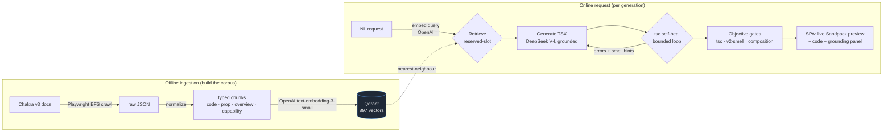

# Spec to Component — Engineering Showcase

> **Status:** 2026-06-30. A portfolio-oriented tour of *how* this project is built and *why* the
> decisions were made. For the developer-facing changelog and setup, see [README.md](README.md);
> numbers here link to their source of truth (they’re re-measured, not eternal).

**Type a UI request in plain English → get a grounded, type-checked, live-rendered Chakra UI v3
component.** A RAG pipeline retrieves real v3 documentation, a model generates the component, and
**objective validators gate the result** — so the output uses the *current* API instead of the v2 API
an LLM remembers.

`TypeScript` · `RAG` · `Qdrant` · `OpenAI embeddings` · `DeepSeek V4 generation` · `React + Chakra UI v3` · `Sandpack` · `Docker` · `Cloud Run`

> **Live demo:** _deploying to Cloud Run (Phase C) — URL coming._ Meanwhile the app is fully runnable
> locally and in a container (see [README_DEPLOY.md](README_DEPLOY.md)).

---

## The problem

Ask any LLM for a Chakra UI component and it confidently emits the **v2** API — `colorScheme`,
`isLoading`, `leftIcon`, `FormControl`, monolithic components — because that’s what dominated its
training data. Chakra **v3** was a major breaking change (`colorPalette`, `loading`, slot-based
composition like `Field.Root`/`NumberInput.Root`). The result *looks* right, compiles in the model’s
head, and is **wrong**.

The fix isn’t a bigger model — it’s **grounding** (retrieve the real v3 docs and put them in context)
plus **objective validation** (prove the output is correct, don’t trust the model’s word).

## What it does

A 5-stage pipeline, each a CLI command, ending in a web UI:

```
crawl → normalize → embed → retrieve → generate → self-heal → validate → render
```

Every generation is gated on **three objective signals** (not an LLM’s opinion):

| Gate | Checks |
|---|---|
| **`tsc`** | Does it type-check against the pinned `@chakra-ui/react@3.27.1`? (runs `tsc` in a sandbox) |
| **v2-smell lint** | Does it use a removed v2 prop (`colorScheme`, `isLoading`, …)? |
| **composition lint** | Are slot-based components fully composed (e.g. `Checkbox.Root` + `Control` + `Label`)? |

The UI shows the rendered component (live, in a real browser sandbox), the code, the objective report,
and — for transparency — **the exact doc chunks the generation was grounded in**.

## Architecture



**Deploy:** one container serves the SPA **and** the API from a single origin (no CORS/proxy).
Generation runs on **DeepSeek V4**; **embeddings stay on OpenAI** (the corpus is `text-embedding-3-small`,
so the query vector must match). The browser render-check is **off in prod** (no Chromium → small
image); Sandpack renders client-side and `tsc` stays the gate. Full runbook:
[README_DEPLOY.md](README_DEPLOY.md).

## Engineering highlights

The product is the easy part. These are the decisions I’d actually talk through in an interview.

### 1. Objective gates over an untrusted LLM judge
The intuitive way to score generations is “ask GPT-4 if it’s good.” I built that — and found the
**LLM judge inverts on v3**: it prefers the familiar v2 API and marks correct v3 as wrong. So the
trusted spine is the three **objective** gates (`tsc` + v2-smell + composition); the judge is a
secondary signal only. *Decisions are backed by signals a compiler can verify, not vibes.* →
[GENERATION_EXPERIMENT.md](GENERATION_EXPERIMENT.md)

### 2. Isolating retrieval’s contribution with an A/B
To prove grounding actually helps (vs. the model just being good), generation runs as a **grounded vs.
no-context 2×2** on 15 deliberately-engineered “v2-landmine” prompts. Knowledge that should come from
retrieval is kept out of the shared prompt, so the delta is attributable to retrieval, not prompt
leakage. → [GENERATION_EXPERIMENT.md](GENERATION_EXPERIMENT.md)

### 3. Honest negative results (the part most portfolios hide)
- **“Thinking mode” gave nothing.** DeepSeek’s extended-reasoning mode was an obvious lever. I A/B’d it
  on the 15 landmines: **no objective-gate improvement and +46% latency** (and the repair pass never
  even fired). Decision: ship it **off**, with the measurement to back it. → [GENERATION_EXPERIMENT.md](GENERATION_EXPERIMENT.md)
- **The “obvious” fix failed first.** A naïve `tsc`-feedback repair loop *didn’t work* — TypeScript’s
  JSX-prop errors don’t name the offending prop. What fixed it was feeding **smell-named hints** that
  point at the exact v2→v3 rename. Knowing *why* the simple thing failed is the insight.

### 4. A cheaper model, made reliable by grounding
Generation moved from gpt-4o to **DeepSeek V4** — cheaper, and with grounding it **beat the gpt-4o
baseline** on the objective gates (grounded `tsc`-pass 93% → **100% single-shot**, 0 repairs). The win
came from the retrieval + validation system, not from spending more on inference. → [README_DEPLOY.md](README_DEPLOY.md)

### 5. Deploy engineering (and the gotchas that don’t make the README)
Single-origin SPA+API, **render-check off in prod** (no Chromium, small image), generation on DeepSeek
/ embeddings on OpenAI, **slim prod image 539 → 462 MB** (reclassified the validator’s runtime deps so
`npm prune --omit=dev` keeps them), and a **Cloud Run** path. Found and fixed in a prod-parity smoke:
a Dockerfile inline-comment-on-`COPY` trap, a **Qdrant Cloud payload-index** requirement that local
Qdrant silently hides, and a benign client/server version-skew warning. → [README_DEPLOY.md](README_DEPLOY.md)

## Results

_As re-measured on the dates in the linked docs — single runs unless noted; generation is
non-deterministic, so treat single-run flips as noise._

| Signal | Result | Source |
|---|---|---|
| Grounded `tsc`-valid (15 v2-landmines) | gpt-4o ~93% hinted → **DeepSeek 100% single-shot** (0 repairs) | [GENERATION_EXPERIMENT.md](GENERATION_EXPERIMENT.md) |
| Held-out generalization (unseen prompts) | **100%** tsc / smell-free / composition | [GENERATION_EXPERIMENT.md](GENERATION_EXPERIMENT.md) |
| Thinking-mode A/B | **no gain, +46% latency** → shipped off | [GENERATION_EXPERIMENT.md](GENERATION_EXPERIMENT.md) |
| Retrieval quality (authentic prose vs templates) | paraphrased gP@k **0.684 → 0.748** | [EVALUATION_STRATEGY.md](EVALUATION_STRATEGY.md) |
| Corpus | **897 chunks** from 50 components (Qdrant, 1536-dim) | [README.md](README.md) |
| Unit tests | **629 passing** across 22 suites | [README.md](README.md) |
| Prod image | **539 → 462 MB** (dep reclassify + prune) | [README_DEPLOY.md](README_DEPLOY.md) |

## Tech stack

- **Pipeline / API:** TypeScript (NodeNext, strict), Commander CLI, Express, Zod.
- **Retrieval:** OpenAI `text-embedding-3-small` (1536-dim) → Qdrant vector store; reserved-slot
  retrieval (fetch the specific component + chunk type the request needs).
- **Generation:** DeepSeek V4 (`deepseek-v4-pro`), OpenAI-compatible; gpt-4o fallback via one env var.
- **Validation:** `tsc` child-process sandbox (pinned `@chakra-ui/react@3.27.1`), curated v2-smell &
  composition lints, optional headless render-check (esbuild + Playwright).
- **Web:** React + **Chakra UI v3** (the app dogfoods the target library), Sandpack live preview,
  Prism code view.
- **Infra:** Docker (multi-stage), Qdrant Cloud, Cloud Run / Render; Jest.

## How it works (one paragraph)

The corpus is built offline: crawl the Chakra v3 docs, normalize each page into typed chunks (code
examples with their real prose, prop references, component overviews, capabilities), embed with OpenAI,
and store in Qdrant. At request time the natural-language prompt is embedded, the most relevant chunks
are retrieved (including a reserved slot for the target component’s blueprint), and DeepSeek generates a
self-contained TSX component grounded in that context. A bounded self-heal loop feeds `tsc` diagnostics
+ v2-smell hints back to the model until it compiles or the cap is hit, then the three objective gates
score the final artifact. The SPA renders it live in a Sandpack browser sandbox and shows the report
plus the chunks it was grounded in.

## Explore further

- **[GENERATION_EXPERIMENT.md](GENERATION_EXPERIMENT.md)** — the A–F correction loop: method, the 2×2
  results, the judge-inversion finding, the thinking-mode A/B. The core engineering narrative.
- **[EVALUATION_STRATEGY.md](EVALUATION_STRATEGY.md)** — retrieval-quality eval (LLM-as-judge, nDCG,
  paraphrase-leakage test) and the authentic-prose-beats-templates verdict.
- **[README_DEPLOY.md](README_DEPLOY.md)** — the cloud deploy runbook (single-origin container, DeepSeek
  swap, slim image, Cloud Run + Render).
- **[README.md](README.md)** — developer setup, the 5 CLI commands, full project structure.
- **[CLAUDE.md](CLAUDE.md)** — the conventions and the objective-signals-are-the-spine philosophy.

## Run it locally

```bash
npm install
cp .env.example .env            # set OPENAI_API_KEY, DEEPSEEK_API_KEY, QDRANT_URL
npm run cli -- 2-embed          # build the corpus (Qdrant up + DEBUG=false)
npm run serve                   # API on :3001
cd web && npm install && npm run dev   # SPA on :5173
```

Then open the SPA and try `a green submit button` — watch it come back with `colorPalette`, not the
v2 `colorScheme`.
