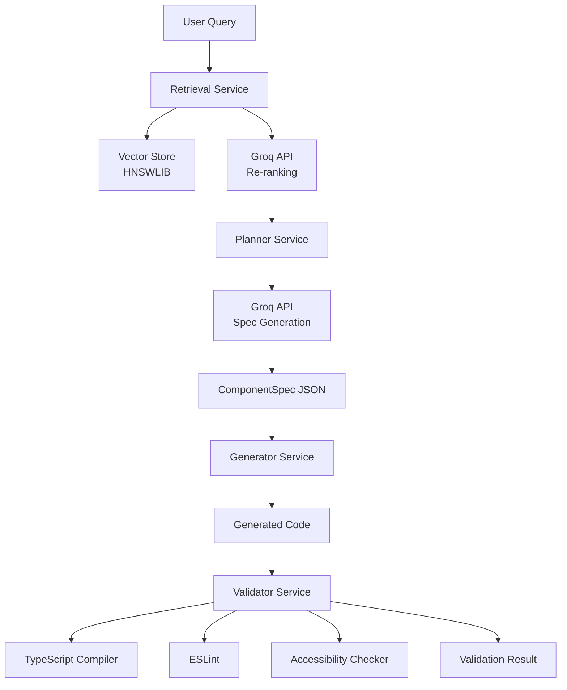

# Enterprise Spec-Driven Component Generator - Technical Project Plan

**Project Name:** Design-MCP
**Version:** 1.0.0
**Last Updated:** 2025-10-16
**Status:** Week 1 Complete, Planning Weeks 2-4

---

## Table of Contents

1. [Executive Summary](#executive-summary)
2. [Current State Analysis](#current-state-analysis)
3. [Week 2: Knowledge Base & Advanced Retrieval](#week-2-knowledge-base--advanced-retrieval)
4. [Week 3: Spec-Driven Generation Engine](#week-3-spec-driven-generation-engine)
5. [Week 4: Production API & DevOps](#week-4-production-api--devops)
6. [Architecture Decisions](#architecture-decisions)
7. [Technical Stack](#technical-stack)
8. [Risk Management](#risk-management)
9. [Success Metrics](#success-metrics)
10. [Future Roadmap](#future-roadmap)

---

## Executive Summary

### Vision
Build an **enterprise-grade, spec-driven component generator** that demonstrates production-ready architecture, advanced AI integration, and sophisticated retrieval-augmented generation (RAG) capabilities. This is not a simple "prompt-to-code" generator—it's a multi-stage pipeline showcasing:

- **Retrieval**: Two-stage (vector similarity + LLM re-ranking)
- **Planning**: Natural language → Formal JSON specification
- **Generation**: Spec → Deterministic, type-safe code
- **Validation**: Static analysis, linting, accessibility checks

### Portfolio Objectives
1. **Technical Depth**: Demonstrate advanced software engineering (clean architecture, testing, CI/CD)
2. **AI Integration**: Show sophisticated LLM usage beyond simple prompting
3. **Production Ready**: Include observability, error handling, security, scalability considerations
4. **Code Quality**: Enterprise-grade TypeScript, >85% test coverage, comprehensive documentation

### Key Differentiators
- **Spec-First Approach**: Formal specification as intermediate representation (repeatable, testable, debuggable)
- **Deterministic Generation**: Same spec → same code (unlike probabilistic LLM-only approaches)
- **Advanced Retrieval**: LLM-powered re-ranking for higher precision
- **Multi-Framework Foundation**: Architecture supports React, Vue, Svelte (future)

---

## Current State Analysis

### ✅ Week 1 Achievements (COMPLETE)

**Infrastructure:**
- ✅ TypeScript project with strict mode, ESM modules
- ✅ CLI framework (Commander.js) with step-based architecture
- ✅ Docker multi-stage build with optimized image
- ✅ Environment-based configuration (.env)

**Extraction Pipeline:**
- ✅ Playwright-based web crawler (BFS traversal)
- ✅ Robust DOM extraction with semantic selectors
- ✅ High-quality code filtering (composition pattern detection)
- ✅ Props table parsing (column-order agnostic)
- ✅ Related components detection

**Data Quality:**
- ✅ Zod schemas for validation (ComponentDoc, Prop, CodeExample)
- ✅ 100% schema validation rate (50/50 components)
- ✅ 100% description coverage
- ✅ 96% code examples coverage (48/50 components, 355 examples)
- ✅ Quality assurance suite (smoke tests + sample viewer)

**Artifacts:**
- 📂 `artifacts/raw-json/` - 50 Chakra UI components as structured JSON
- 📊 Average 7.1 filtered code examples per component
- 🔗 Related component graph data for cross-component queries

### Gaps Analysis

**Missing Components for Original Vision:**

| Feature | Status | Priority | Complexity |
|---------|--------|----------|------------|
| Vector embeddings + HNSWLIB store | ❌ Missing | P0 - Critical | Medium |
| LLM-powered retrieval re-ranking | ❌ Missing | P0 - Critical | Medium |
| Component spec schema (formal) | ❌ Missing | P0 - Critical | Low |
| Planner service (prompt → spec) | ❌ Missing | P0 - Critical | High |
| Generator service (spec → code) | ❌ Missing | P0 - Critical | High |
| Validator service (static analysis) | ❌ Missing | P0 - Critical | Medium |
| MCP server with tools | ❌ Missing | P1 - Important | Medium |
| CI/CD pipeline | ❌ Missing | P1 - Important | Low |
| Comprehensive testing (>85%) | ❌ Missing | P1 - Important | High |
| Production deployment | ❌ Missing | P2 - Nice-to-have | Low |

**Technical Debt:**
- No data normalization layer (raw extracts may have duplicates)
- No chunking strategy for embeddings (needed for long documents)
- No error recovery mechanisms in crawler
- No performance benchmarks or profiling

---

## Week 2: Knowledge Base & Advanced Retrieval

**Timeline:** Days 8-14 (7 days)
**Goal:** Transform raw extracts into a queryable knowledge base with intelligent, two-stage retrieval

---

### Phase 2A: Data Normalization & Preparation (Days 8-9, 16 hours)

#### **Objectives**
- Create a normalized, deduplicated dataset
- Implement semantic chunking for embeddings
- Prepare metadata-rich documents for vector indexing

#### **Tasks**

**Task 2A.1: Normalization Pipeline (6 hours)**

Create `src/steps/1-normalize-docs/normalizer.ts`:

```typescript
interface NormalizedDoc {
  id: string;                    // Unique identifier (hash of sourceUrl + componentName)
  componentName: string;         // Canonical component name
  sourceUrls: string[];          // May have multiple sources (merged)
  description: string;
  props: NormalizedProp[];       // Deduplicated and merged
  codeExamples: CodeExample[];   // Filtered and deduplicated
  relatedComponents: string[];   // Aggregated across all sources
  metadata: {
    extractedAt: string;
    version: string;             // For future multi-version support
    framework: 'react' | 'vue' | 'angular';  // For multi-framework
  };
}
```

**Implementation details:**
- Read all files from `artifacts/raw-json/`
- Group by `componentName` (handle case variations: "Button" vs "button")
- Merge duplicate props (prefer more detailed descriptions)
- Deduplicate code examples (hash-based comparison)
- Validate with `NormalizedDocSchema` (Zod)
- Output to `artifacts/normalized/components.json` (single file or per-component)

**Acceptance criteria:**
- ✅ All 50 components processed without errors
- ✅ No duplicate props within same component
- ✅ Code examples deduplicated (measure: <80% of original count)
- ✅ Schema validation 100% pass rate

**Estimated time:** 6 hours (4 dev, 2 test)

---

**Task 2A.2: Semantic Chunking Strategy (6 hours)**

Create `src/steps/1-normalize-docs/chunker.ts`:

```typescript
interface DocumentChunk {
  id: string;                    // Unique chunk ID
  componentName: string;         // Parent component
  content: string;               // Actual text (400-800 tokens)
  type: 'description' | 'prop' | 'code_example' | 'accessibility';
  metadata: {
    section?: string;            // e.g., "Usage", "Props", "Accessibility"
    language?: string;           // For code chunks
    propName?: string;           // For prop description chunks
    relatedComponents?: string[]; // Context for retrieval
  };
}
```

**Chunking rules:**
1. **Descriptions**: Keep as single chunk if <800 tokens, otherwise split on sentence boundaries
2. **Props**: Each prop as individual chunk (includes name + type + description)
3. **Code examples**: Never split—keep as complete unit
4. **Accessibility notes**: Separate chunk with high priority in retrieval

**Token estimation:**
- Use simple heuristic: 1 token ≈ 4 characters (GPT tokenizer approximation)
- Target: 400-800 tokens per chunk (balance between context and granularity)

**Acceptance criteria:**
- ✅ All chunks between 100-1000 tokens (allow edge cases)
- ✅ Code examples never split mid-function
- ✅ Chunks have complete metadata
- ✅ Estimate ~500-800 total chunks from 50 components

**Estimated time:** 6 hours (3 dev, 2 test, 1 validation)

---

**Task 2A.3: CLI Integration (4 hours)**

Update `src/index.ts` to add command:

```bash
npm run cli -- 1-normalize-docs
```

**Features:**
- Progress bar for processing (use `cli-progress` or similar)
- Summary statistics (components processed, chunks created, duplicates removed)
- Validation report (schema failures, warnings)

**Output:**
```
artifacts/
├── normalized/
│   ├── components.json          # All normalized components
│   └── chunks/
│       ├── metadata.json         # Chunk index with IDs and metadata
│       ├── chunk-001.json        # Individual chunks for easy loading
│       ├── chunk-002.json
│       └── ...
```

**Acceptance criteria:**
- ✅ Command runs without errors
- ✅ Output files created and validated
- ✅ CLI shows progress and summary

**Estimated time:** 4 hours (2 dev, 1 test, 1 docs)

---

### Phase 2B: Vector Store & Embeddings (Days 10-12, 24 hours)

#### **Objectives**
- Generate embeddings for all chunks using local model (no API costs)
- Build HNSWLIB vector index for fast similarity search
- Create retrieval service with query interface

#### **Tasks**

**Task 2B.1: Embedding Generation with Xenova.js (8 hours)**

Create `src/services/EmbeddingService.ts`:

```typescript
import { pipeline } from '@xenova/transformers';

class EmbeddingService {
  private embedder: any;

  async initialize() {
    // Use all-MiniLM-L6-v2 (384 dimensions, fast, good quality)
    this.embedder = await pipeline(
      'feature-extraction',
      'Xenova/all-MiniLM-L6-v2'
    );
  }

  async embed(text: string): Promise<number[]> {
    const output = await this.embedder(text, {
      pooling: 'mean',
      normalize: true
    });
    return Array.from(output.data);
  }

  async batchEmbed(texts: string[]): Promise<number[][]> {
    // Process in batches of 32 for efficiency
    // Return array of embeddings
  }
}
```

**Implementation details:**
- Initialize model once (cache in memory)
- Batch process chunks (32 at a time for memory efficiency)
- Show progress bar for long operations
- Save embeddings alongside chunk metadata
- Handle errors gracefully (retry logic for transient failures)

**Performance targets:**
- Process 800 chunks in <5 minutes on standard laptop
- Memory usage <2GB during embedding

**Acceptance criteria:**
- ✅ All chunks embedded successfully
- ✅ Embedding dimension = 384 (verify)
- ✅ Embeddings normalized (L2 norm = 1.0)
- ✅ Saved to `stores/embeddings/embeddings.json`

**Estimated time:** 8 hours (4 dev, 2 test, 2 optimization)

---

**Task 2B.2: HNSWLIB Vector Index (8 hours)**

Create `src/services/VectorStoreService.ts`:

```typescript
import { HierarchicalNSW } from 'hnswlib-node';

class VectorStoreService {
  private index: HierarchicalNSW;

  async build(embeddings: number[][], metadata: ChunkMetadata[]) {
    const numDimensions = 384;
    const maxElements = embeddings.length;

    this.index = new HierarchicalNSW('cosine', numDimensions);
    this.index.initIndex(maxElements);

    for (let i = 0; i < embeddings.length; i++) {
      this.index.addPoint(embeddings[i], i);
    }

    // Save to disk
    this.index.writeIndexSync('stores/vector-index/index.bin');
    // Save metadata separately
    fs.writeFileSync(
      'stores/vector-index/metadata.json',
      JSON.stringify(metadata)
    );
  }

  async search(queryEmbedding: number[], k: number = 25): Promise<SearchResult[]> {
    const { neighbors, distances } = this.index.searchKnn(queryEmbedding, k);

    return neighbors.map((idx, i) => ({
      chunkId: this.metadata[idx].id,
      componentName: this.metadata[idx].componentName,
      content: this.chunks[idx].content,
      score: 1 - distances[i],  // Convert cosine distance to similarity
      metadata: this.metadata[idx]
    }));
  }
}
```

**Implementation details:**
- Use cosine similarity (best for normalized embeddings)
- HNSW parameters: M=16, efConstruction=200 (good balance)
- Persist index to disk for fast startup
- Load index on service initialization

**Index structure:**
```
stores/
└── vector-index/
    ├── index.bin              # HNSWLIB binary index
    ├── metadata.json          # Chunk metadata (ID, component, type)
    └── chunks.json            # Actual chunk content (for retrieval)
```

**Acceptance criteria:**
- ✅ Index builds without errors
- ✅ Search returns results in <50ms for k=25
- ✅ Index file size <50MB
- ✅ Metadata correctly mapped to indices

**Estimated time:** 8 hours (4 dev, 2 test, 2 optimization)

---

**Task 2B.3: Retrieval Service - Stage 1 (8 hours)**

Create `src/services/RetrievalService.ts`:

```typescript
interface RetrievalResult {
  chunks: ChunkWithScore[];
  query: string;
  retrievalMethod: 'vector_only' | 'vector_with_rerank';
  metadata: {
    totalCandidates: number;
    retrievalTimeMs: number;
    rerankingTimeMs?: number;
  };
}

class RetrievalService {
  constructor(
    private embeddingService: EmbeddingService,
    private vectorStore: VectorStoreService
  ) {}

  async search(query: string, topK: number = 25): Promise<RetrievalResult> {
    const startTime = Date.now();

    // Stage 1: Vector similarity search
    const queryEmbedding = await this.embeddingService.embed(query);
    const candidates = await this.vectorStore.search(queryEmbedding, topK);

    const retrievalTimeMs = Date.now() - startTime;

    return {
      chunks: candidates,
      query,
      retrievalMethod: 'vector_only',
      metadata: {
        totalCandidates: candidates.length,
        retrievalTimeMs
      }
    };
  }
}
```

**Acceptance criteria:**
- ✅ Service initializes with both dependencies
- ✅ Search completes in <100ms
- ✅ Returns relevant results for test queries
- ✅ Properly handles empty results

**Estimated time:** 8 hours (4 dev, 3 test, 1 integration)

---

### Phase 2C: LLM-Powered Re-ranking (Days 13-14, 16 hours)

#### **Objectives**
- Implement Stage 2 retrieval: LLM-based re-ranking
- Integrate Groq API for fast inference
- Create comprehensive evaluation suite

#### **Tasks**

**Task 2C.1: Groq API Integration (6 hours)**

Create `src/services/GroqService.ts`:

```typescript
import Groq from 'groq-sdk';

interface RerankRequest {
  query: string;
  documents: Array<{
    id: string;
    content: string;
  }>;
}

interface RerankResponse {
  rankedDocuments: Array<{
    id: string;
    relevanceScore: number;  // 0-10 from LLM
    reasoning?: string;
  }>;
}

class GroqService {
  private client: Groq;

  constructor(apiKey: string) {
    this.client = new Groq({ apiKey });
  }

  async rerank(request: RerankRequest): Promise<RerankResponse> {
    const prompt = this.buildRerankPrompt(request);

    const response = await this.client.chat.completions.create({
      model: 'llama-3.1-70b-versatile',  // Fast, good reasoning
      messages: [
        {
          role: 'system',
          content: 'You are an expert at evaluating document relevance for component generation queries.'
        },
        {
          role: 'user',
          content: prompt
        }
      ],
      response_format: { type: 'json_object' },  // Structured output
      temperature: 0.1  // Deterministic
    });

    return JSON.parse(response.choices[0].message.content);
  }

  private buildRerankPrompt(request: RerankRequest): string {
    return `
Given the user query and candidate documents, rank each document's relevance.

Query: "${request.query}"

Documents:
${request.documents.map((doc, i) => `
[${i}] ID: ${doc.id}
${doc.content.substring(0, 500)}...
`).join('\n')}

Analyze each document and return a JSON object:
{
  "rankedDocuments": [
    {
      "id": "chunk-001",
      "relevanceScore": 9,
      "reasoning": "Directly demonstrates the requested pattern"
    },
    ...
  ]
}

Relevance scale:
- 9-10: Directly answers the query
- 7-8: Highly relevant context
- 5-6: Somewhat relevant
- 3-4: Tangentially related
- 0-2: Not relevant

Only include documents with score ≥5.
    `.trim();
  }
}
```

**Implementation details:**
- Use structured output mode (JSON) for reliability
- Low temperature (0.1) for consistency
- Truncate long documents in prompt (max 500 chars per doc)
- Handle API errors gracefully (fallback to vector-only ranking)
- Implement rate limiting (respect Groq API limits)

**Acceptance criteria:**
- ✅ API integration works with test queries
- ✅ Returns valid JSON with scores
- ✅ Handles errors without crashing
- ✅ Respects rate limits

**Estimated time:** 6 hours (3 dev, 2 test, 1 error handling)

---

**Task 2C.2: Two-Stage Retrieval Integration (6 hours)**

Update `RetrievalService` with re-ranking:

```typescript
class RetrievalService {
  async searchWithReranking(
    query: string,
    initialK: number = 25,
    finalK: number = 10
  ): Promise<RetrievalResult> {
    const startTime = Date.now();

    // Stage 1: Fast vector search
    const queryEmbedding = await this.embeddingService.embed(query);
    const candidates = await this.vectorStore.search(queryEmbedding, initialK);

    const retrievalTimeMs = Date.now() - startTime;
    const rerankStartTime = Date.now();

    // Stage 2: LLM re-ranking
    const rerankRequest = {
      query,
      documents: candidates.map(c => ({
        id: c.chunkId,
        content: c.content
      }))
    };

    const reranked = await this.groqService.rerank(rerankRequest);

    // Sort by LLM scores and take top K
    const finalResults = reranked.rankedDocuments
      .sort((a, b) => b.relevanceScore - a.relevanceScore)
      .slice(0, finalK)
      .map(doc => {
        const original = candidates.find(c => c.chunkId === doc.id);
        return {
          ...original,
          rerankScore: doc.relevanceScore,
          rerankReasoning: doc.reasoning
        };
      });

    const rerankingTimeMs = Date.now() - rerankStartTime;

    return {
      chunks: finalResults,
      query,
      retrievalMethod: 'vector_with_rerank',
      metadata: {
        totalCandidates: initialK,
        retrievalTimeMs,
        rerankingTimeMs
      }
    };
  }
}
```

**Performance targets:**
- Total retrieval time: <2 seconds (vector + rerank)
- Vector search: <100ms
- Re-ranking: <1.9 seconds

**Acceptance criteria:**
- ✅ Two-stage retrieval completes successfully
- ✅ Re-ranked results demonstrably better than vector-only
- ✅ Performance within targets
- ✅ Fallback to vector-only if re-ranking fails

**Estimated time:** 6 hours (3 dev, 2 test, 1 optimization)

---

**Task 2C.3: Evaluation Suite (4 hours)**

Create `src/steps/1-normalize-docs/evaluate-retrieval.ts`:

**Test queries:**
```typescript
const testQueries = [
  {
    query: "a primary button with loading state",
    expectedComponents: ["Button"],
    expectedKeywords: ["variant", "isLoading", "spinner"]
  },
  {
    query: "a modal with form validation",
    expectedComponents: ["Modal", "Form", "Input"],
    expectedKeywords: ["onSubmit", "validation", "error"]
  },
  {
    query: "accessible tooltip with keyboard navigation",
    expectedComponents: ["Tooltip"],
    expectedKeywords: ["aria-", "keyboard", "focus"]
  },
  // Add 10-15 more test cases
];
```

**Metrics to track:**
- **Precision@K**: What % of top-K results are relevant?
- **Recall**: Are all relevant chunks retrieved?
- **MRR (Mean Reciprocal Rank)**: Position of first relevant result
- **Component coverage**: Are related components included?

**Output:**
```
Retrieval Evaluation Report
===========================

Query: "a primary button with loading state"
├── Vector-only (top 10)
│   ├── Precision@10: 0.7
│   ├── MRR: 0.5 (first relevant at position 2)
│   └── Component coverage: 1/1 (Button)
└── With re-ranking (top 10)
    ├── Precision@10: 0.9
    ├── MRR: 1.0 (first relevant at position 1)
    └── Component coverage: 1/1 (Button)

Average across all queries:
├── Vector-only: Precision 0.65, MRR 0.58
└── With reranking: Precision 0.82, MRR 0.79
```

**Acceptance criteria:**
- ✅ Re-ranking improves precision by >15%
- ✅ Re-ranking improves MRR by >10%
- ✅ All test queries return relevant results
- ✅ Report generated in markdown format

**Estimated time:** 4 hours (2 dev, 2 testing/refinement)

---

### Week 2 Deliverables

**CLI Commands:**
```bash
npm run cli -- 1-normalize-docs           # Normalize and chunk
npm run cli -- 2-build-vector-store       # Generate embeddings + index
npm run cli -- 2-evaluate-retrieval       # Run evaluation suite
```

**Artifacts:**
- `artifacts/normalized/` - Normalized component data and chunks
- `stores/vector-index/` - HNSWLIB index + metadata
- `stores/embeddings/` - Cached embeddings
- `docs/week2/RETRIEVAL_EVALUATION.md` - Evaluation report

**Code:**
- `src/steps/1-normalize-docs/` - Normalization pipeline
- `src/services/EmbeddingService.ts` - Embedding generation
- `src/services/VectorStoreService.ts` - HNSWLIB wrapper
- `src/services/GroqService.ts` - LLM API integration
- `src/services/RetrievalService.ts` - Two-stage retrieval

**Tests:**
- Unit tests for each service (>80% coverage)
- Integration tests for full retrieval pipeline
- Evaluation suite with ground truth queries

**Documentation:**
- Architecture diagrams for retrieval flow
- API documentation for services
- Performance benchmarks

---

## Week 3: Spec-Driven Generation Engine

**Timeline:** Days 15-21 (7 days)
**Goal:** Build the core `Plan → Generate → Validate` pipeline with clean architecture

---

### Phase 3A: Component Specification Schema (Days 15-16, 16 hours)

#### **Objectives**
- Define formal component specification schema
- Create planner service that transforms queries into specs
- Ensure specs are deterministic and complete

#### **Tasks**

**Task 3A.1: ComponentSpec Schema Design (4 hours)**

Create `src/schemas/ComponentSpecSchema.ts`:

```typescript
import { z } from 'zod';

/**
 * Formal component specification
 * This is the intermediate representation between planning and generation
 */

const PropDefinitionSchema = z.object({
  name: z.string(),
  type: z.string(),              // TypeScript type string
  required: z.boolean(),
  defaultValue: z.string().optional(),
  description: z.string(),
  validation: z.object({         // For runtime validation
    pattern: z.string().optional(),  // Regex for strings
    min: z.number().optional(),      // Min value/length
    max: z.number().optional(),      // Max value/length
    enum: z.array(z.string()).optional()  // Allowed values
  }).optional()
});

const VariantDefinitionSchema = z.object({
  name: z.string(),              // e.g., "size", "variant", "colorScheme"
  type: z.enum(['enum', 'boolean']),
  values: z.array(z.string()),   // e.g., ["sm", "md", "lg"]
  defaultValue: z.string(),
  affectedStyles: z.array(z.string())  // CSS properties affected
});

const AccessibilityRequirementSchema = z.object({
  role: z.string().optional(),
  ariaLabel: z.boolean().default(false),
  ariaDescribedBy: z.boolean().default(false),
  keyboardNavigation: z.object({
    required: z.boolean(),
    keys: z.array(z.string()).optional()  // e.g., ["Enter", "Space", "Escape"]
  }).optional(),
  focusManagement: z.string().optional()
});

const ComponentSpecSchema = z.object({
  // Identity
  componentName: z.string().regex(/^[A-Z][a-zA-Z0-9]*$/),  // PascalCase
  description: z.string(),
  category: z.enum(['form', 'layout', 'feedback', 'overlay', 'disclosure', 'navigation', 'media', 'data-display']),

  // Structure
  framework: z.enum(['react', 'vue', 'svelte']).default('react'),
  baseComponent: z.string().optional(),  // If extending another component
  composition: z.object({
    isComposite: z.boolean(),            // Does it compose other components?
    children: z.array(z.string()).optional(),  // Which components to use
    slots: z.array(z.string()).optional()      // Named slots (for Vue/Svelte)
  }),

  // Props
  props: z.array(PropDefinitionSchema),
  variants: z.array(VariantDefinitionSchema).optional(),

  // Styling
  styling: z.object({
    approach: z.enum(['css-in-js', 'tailwind', 'css-modules', 'styled-components']),
    baseStyles: z.record(z.string(), z.string()).optional(),  // CSS properties
    tokens: z.array(z.string()).optional()  // Design tokens to use
  }),

  // Behavior
  eventHandlers: z.array(z.object({
    name: z.string(),                    // e.g., "onClick", "onSubmit"
    description: z.string(),
    parameters: z.array(z.object({
      name: z.string(),
      type: z.string()
    }))
  })).optional(),

  // Accessibility
  accessibility: AccessibilityRequirementSchema,

  // Dependencies
  dependencies: z.object({
    internal: z.array(z.string()).optional(),   // Other components from system
    external: z.array(z.string()).optional()    // npm packages
  }),

  // Examples
  usageExamples: z.array(z.object({
    title: z.string(),
    description: z.string(),
    code: z.string()
  })).optional(),

  // Metadata
  metadata: z.object({
    generatedFrom: z.string(),           // Original query
    retrievedContext: z.array(z.string()),  // Chunk IDs used
    confidence: z.number().min(0).max(1),   // LLM confidence
    createdAt: z.string()
  })
});

export type ComponentSpec = z.infer<typeof ComponentSpecSchema>;
export { ComponentSpecSchema };
```

**Design rationale:**
- **Completeness**: Spec contains all information needed for generation
- **Type safety**: Strong TypeScript types for compile-time validation
- **Framework agnostic**: Structure supports React, Vue, Svelte
- **Accessibility first**: Required field, not optional
- **Traceability**: Metadata tracks which context was used

**Acceptance criteria:**
- ✅ Schema compiles without errors
- ✅ Sample specs validate successfully
- ✅ Documentation explains all fields
- ✅ Examples for each component category

**Estimated time:** 4 hours (2 design, 1 implementation, 1 docs/examples)

---

**Task 3A.2: Planner Service Implementation (8 hours)**

Create `src/services/PlannerService.ts`:

```typescript
class PlannerService {
  constructor(
    private retrievalService: RetrievalService,
    private groqService: GroqService
  ) {}

  async createSpec(userQuery: string): Promise<ComponentSpec> {
    // Step 1: Retrieve relevant context
    const retrievalResult = await this.retrievalService.searchWithReranking(
      userQuery,
      25,  // Initial candidates
      10   // Final re-ranked
    );

    // Step 2: Build planning prompt
    const planningPrompt = this.buildPlanningPrompt(userQuery, retrievalResult.chunks);

    // Step 3: Call LLM with structured output
    const response = await this.groqService.client.chat.completions.create({
      model: 'llama-3.1-70b-versatile',
      messages: [
        {
          role: 'system',
          content: PLANNER_SYSTEM_PROMPT
        },
        {
          role: 'user',
          content: planningPrompt
        }
      ],
      response_format: { type: 'json_object' },
      temperature: 0.2  // Slightly creative but consistent
    });

    const rawSpec = JSON.parse(response.choices[0].message.content);

    // Step 4: Validate against schema
    const validatedSpec = ComponentSpecSchema.parse({
      ...rawSpec,
      metadata: {
        generatedFrom: userQuery,
        retrievedContext: retrievalResult.chunks.map(c => c.chunkId),
        confidence: this.calculateConfidence(retrievalResult),
        createdAt: new Date().toISOString()
      }
    });

    return validatedSpec;
  }

  private buildPlanningPrompt(query: string, context: ChunkWithScore[]): string {
    return `
You are an expert frontend architect. Create a formal component specification.

User Request: "${query}"

Retrieved Context:
${context.map((chunk, i) => `
[${i + 1}] ${chunk.componentName} - ${chunk.metadata.type}
${chunk.content}
Relevance: ${chunk.rerankScore}/10
`).join('\n---\n')}

Based on this context, create a complete ComponentSpec JSON that includes:
1. Component identity (name, description, category)
2. Props with TypeScript types and validation rules
3. Variants (sizes, colors, states)
4. Styling approach and base styles
5. Event handlers
6. Accessibility requirements (ARIA roles, keyboard nav)
7. Dependencies (internal components, external packages)
8. Usage examples

Ensure the spec is:
- Complete (all required fields filled)
- Type-safe (valid TypeScript types)
- Accessible (WCAG 2.1 AA compliant)
- Consistent with the design system patterns shown in context

Return ONLY valid JSON matching the ComponentSpec schema.
    `.trim();
  }

  private calculateConfidence(result: RetrievalResult): number {
    // Confidence based on:
    // 1. Re-ranking scores (higher = more confident)
    // 2. Number of high-quality chunks (>7/10 score)
    // 3. Component coverage (multiple related components = good)

    const avgScore = result.chunks.reduce((sum, c) => sum + (c.rerankScore || 0), 0) / result.chunks.length;
    const highQualityCount = result.chunks.filter(c => (c.rerankScore || 0) >= 7).length;
    const componentCoverage = new Set(result.chunks.map(c => c.componentName)).size;

    return Math.min(
      (avgScore / 10) * 0.5 +
      (highQualityCount / result.chunks.length) * 0.3 +
      (Math.min(componentCoverage / 3, 1)) * 0.2,
      1.0
    );
  }
}
```

**Planner system prompt:**
```typescript
const PLANNER_SYSTEM_PROMPT = `
You are an expert frontend architect specializing in design systems and component-driven development.

Your task is to analyze user requests for UI components and create formal, complete component specifications.

Key principles:
1. **Completeness**: Specs must include all information needed for code generation
2. **Type Safety**: All props must have valid TypeScript types
3. **Accessibility**: Every component must meet WCAG 2.1 AA standards
4. **Consistency**: Follow patterns from the provided design system context
5. **Composability**: Prefer composition over complex monolithic components

When creating specs:
- Infer reasonable defaults from design system patterns
- Include comprehensive prop validation rules
- Specify keyboard navigation requirements
- List all ARIA attributes needed
- Identify reusable internal components
- Provide clear, actionable usage examples

Return ONLY valid JSON. No explanations or markdown.
`.trim();
```

**Error handling:**
- If retrieval returns <3 relevant chunks (all scores <5), return error with suggestion
- If LLM returns invalid JSON, retry once with simplified prompt
- If schema validation fails, log detailed Zod errors and return actionable message

**Acceptance criteria:**
- ✅ Creates valid ComponentSpec from test queries
- ✅ Includes all required fields
- ✅ Confidence scores are reasonable (0.6-0.9 for good queries)
- ✅ Handles edge cases gracefully

**Estimated time:** 8 hours (4 dev, 2 test, 2 refinement)

---

**Task 3A.3: CLI Integration & Testing (4 hours)**

Create command:
```bash
npm run cli -- plan "a primary button with loading state"
```

**Output:**
```
Planning component...
├── Retrieved 10 relevant chunks (avg score: 8.2/10)
├── Generated spec with confidence: 0.85
└── Saved to: artifacts/specs/PrimaryButton-20251016-123045.json

Component: PrimaryButton
├── Props: 8 (variant, size, isLoading, isDisabled, ...)
├── Variants: 3 (variant, size, colorScheme)
├── Accessibility: ✓ ARIA role, keyboard nav, focus management
└── Dependencies: 2 internal (Spinner, Box)
```

**Test suite:**
```typescript
describe('PlannerService', () => {
  it('creates valid spec for simple button', async () => {
    const spec = await planner.createSpec('a primary button');
    expect(spec.componentName).toMatch(/^[A-Z]/);
    expect(spec.props.length).toBeGreaterThan(0);
    expect(spec.accessibility).toBeDefined();
  });

  it('handles complex composite components', async () => {
    const spec = await planner.createSpec('a modal with form validation');
    expect(spec.composition.isComposite).toBe(true);
    expect(spec.composition.children).toContain('Modal');
  });

  it('infers accessibility requirements', async () => {
    const spec = await planner.createSpec('an accessible tooltip');
    expect(spec.accessibility.role).toBeDefined();
    expect(spec.accessibility.keyboardNavigation?.required).toBe(true);
  });
});
```

**Acceptance criteria:**
- ✅ CLI command works end-to-end
- ✅ Test suite passes with >80% coverage
- ✅ Specs are human-readable and complete

**Estimated time:** 4 hours (2 CLI dev, 2 testing)

---

### Phase 3B: Generator Service (Days 17-18, 16 hours)

#### **Objectives**
- Create deterministic code generator from specs
- Support React with TypeScript
- Generate clean, production-ready code

#### **Tasks**

**Task 3B.1: Code Generation Engine (10 hours)**

Create `src/services/GeneratorService.ts`:

```typescript
class GeneratorService {
  async generate(spec: ComponentSpec): Promise<GeneratedCode> {
    // Step 1: Generate TypeScript interfaces
    const interfaces = this.generateInterfaces(spec);

    // Step 2: Generate component code
    const componentCode = this.generateComponent(spec);

    // Step 3: Generate styles (if CSS-in-JS)
    const styles = this.generateStyles(spec);

    // Step 4: Generate tests (optional but recommended)
    const tests = this.generateTests(spec);

    // Step 5: Combine and format
    const finalCode = await this.formatCode({
      interfaces,
      component: componentCode,
      styles,
      exports: this.generateExports(spec)
    });

    return {
      filePath: `${spec.componentName}.tsx`,
      code: finalCode,
      testFilePath: `${spec.componentName}.test.tsx`,
      testCode: tests,
      dependencies: this.extractDependencies(spec)
    };
  }

  private generateInterfaces(spec: ComponentSpec): string {
    const propsInterface = `
export interface ${spec.componentName}Props {
${spec.props.map(prop => {
  const optional = prop.required ? '' : '?';
  const description = prop.description ? `  /** ${prop.description} */\n` : '';
  return `${description}  ${prop.name}${optional}: ${prop.type};`;
}).join('\n')}
}
    `.trim();

    return propsInterface;
  }

  private generateComponent(spec: ComponentSpec): string {
    const propsDestructure = spec.props.map(p => p.name).join(', ');
    const propsWithDefaults = spec.props
      .filter(p => p.defaultValue)
      .map(p => `${p.name} = ${p.defaultValue}`)
      .join(', ');

    return `
export const ${spec.componentName}: React.FC<${spec.componentName}Props> = ({
  ${propsDestructure}
}) => {
  ${this.generateHooks(spec)}
  ${this.generateEventHandlers(spec)}

  return (
    ${this.generateJSX(spec)}
  );
};

${this.generateDisplayName(spec)}
    `.trim();
  }

  private generateJSX(spec: ComponentSpec): string {
    // This is the core logic - generates JSX based on spec

    const ariaProps = this.generateAriaAttributes(spec.accessibility);
    const eventHandlers = spec.eventHandlers?.map(e =>
      `${e.name}={${e.name}}`
    ).join(' ') || '';

    if (spec.composition.isComposite) {
      return this.generateCompositeJSX(spec);
    }

    // Simple component
    return `
    <${spec.baseComponent || 'div'}
      ${ariaProps}
      ${eventHandlers}
      className={styles.root}
    >
      {children}
    </${spec.baseComponent || 'div'}>
    `.trim();
  }

  private generateCompositeJSX(spec: ComponentSpec): string {
    // For composite components (Modal with Form, etc.)
    // Use composition pattern based on spec.composition

    const children = spec.composition.children || [];

    // Example for Modal + Form composition
    if (children.includes('Modal') && children.includes('Form')) {
      return `
    <Modal isOpen={isOpen} onClose={onClose}>
      <ModalOverlay />
      <ModalContent>
        <ModalHeader>{title}</ModalHeader>
        <ModalBody>
          <Form onSubmit={onSubmit}>
            {children}
          </Form>
        </ModalBody>
        <ModalFooter>
          <Button variant="ghost" onClick={onClose}>Cancel</Button>
          <Button type="submit" colorScheme="blue">Submit</Button>
        </ModalFooter>
      </ModalContent>
    </Modal>
      `.trim();
    }

    // Generic composition fallback
    return `
    <div className={styles.root}>
      {children}
    </div>
    `.trim();
  }

  private generateAriaAttributes(accessibility: AccessibilityRequirement): string {
    const attrs: string[] = [];

    if (accessibility.role) {
      attrs.push(`role="${accessibility.role}"`);
    }
    if (accessibility.ariaLabel) {
      attrs.push(`aria-label={ariaLabel}`);
    }
    if (accessibility.ariaDescribedBy) {
      attrs.push(`aria-describedby={ariaDescribedBy}`);
    }

    return attrs.join('\n      ');
  }

  private async formatCode(code: string): Promise<string> {
    // Use Prettier for consistent formatting
    const prettier = await import('prettier');

    return prettier.format(code, {
      parser: 'typescript',
      semi: true,
      singleQuote: true,
      trailingComma: 'es5',
      printWidth: 80
    });
  }
}
```

**Template structure:**
```
Generated file structure:
├── ComponentName.tsx          # Main component
├── ComponentName.types.ts     # TypeScript interfaces
├── ComponentName.styles.ts    # Styles (if CSS-in-JS)
└── ComponentName.test.tsx     # Basic tests
```

**Acceptance criteria:**
- ✅ Generates valid TypeScript/React code
- ✅ Includes all props from spec
- ✅ Handles composite components
- ✅ Includes accessibility attributes
- ✅ Code passes TypeScript compilation

**Estimated time:** 10 hours (6 dev, 3 test, 1 refinement)

---

**Task 3B.2: Template System for Variants (4 hours)**

Handle different styling approaches:

```typescript
class StyleGenerator {
  generate(spec: ComponentSpec): string {
    switch (spec.styling.approach) {
      case 'css-in-js':
        return this.generateCSSInJS(spec);
      case 'tailwind':
        return this.generateTailwind(spec);
      case 'css-modules':
        return this.generateCSSModules(spec);
      default:
        return this.generateInlineStyles(spec);
    }
  }

  private generateCSSInJS(spec: ComponentSpec): string {
    return `
import { css } from '@emotion/react';

const styles = {
  root: css({
    ${Object.entries(spec.styling.baseStyles || {})
      .map(([key, value]) => `${key}: '${value}'`)
      .join(',\n    ')}
  }),

  ${spec.variants?.map(variant => `
  ${variant.name}: {
    ${variant.values.map(value => `
    ${value}: css({
      // Styles for ${variant.name}="${value}"
    })
    `).join(',\n')}
  }
  `).join(',\n')}
};

export default styles;
    `.trim();
  }
}
```

**Acceptance criteria:**
- ✅ Supports multiple styling approaches
- ✅ Generates variant styles correctly
- ✅ Respects design tokens

**Estimated time:** 4 hours (2 dev, 2 test)

---

**Task 3B.3: CLI Integration (2 hours)**

```bash
npm run cli -- generate artifacts/specs/PrimaryButton-20251016-123045.json
```

**Output:**
```
Generating component from spec...
├── Component: PrimaryButton
├── Framework: react
├── Styling: css-in-js
└── Generated files:
    ├── src/generated/PrimaryButton.tsx (152 lines)
    ├── src/generated/PrimaryButton.types.ts (24 lines)
    ├── src/generated/PrimaryButton.styles.ts (48 lines)
    └── src/generated/PrimaryButton.test.tsx (67 lines)

Next steps:
1. Review generated code
2. Run validation: npm run cli -- validate src/generated/PrimaryButton.tsx
3. Run tests: npm test PrimaryButton
```

**Acceptance criteria:**
- ✅ CLI generates all files
- ✅ Files are created in correct locations
- ✅ Summary shows useful information

**Estimated time:** 2 hours

---

### Phase 3C: Validator Service (Days 19-20, 16 hours)

#### **Objectives**
- Static analysis for generated code
- Catch errors before runtime
- Ensure accessibility compliance

#### **Tasks**

**Task 3C.1: TypeScript Validation (4 hours)**

Create `src/services/ValidatorService.ts`:

```typescript
import { execSync } from 'child_process';
import * as ts from 'typescript';

interface ValidationResult {
  isValid: boolean;
  errors: ValidationError[];
  warnings: ValidationWarning[];
  summary: {
    typeErrors: number;
    lintErrors: number;
    accessibilityErrors: number;
  };
}

class ValidatorService {
  async validateTypeScript(filePath: string): Promise<ValidationResult> {
    const configPath = ts.findConfigFile(
      path.dirname(filePath),
      ts.sys.fileExists,
      'tsconfig.json'
    );

    const { config } = ts.readConfigFile(configPath!, ts.sys.readFile);
    const { options } = ts.parseJsonConfigFileContent(
      config,
      ts.sys,
      path.dirname(configPath!)
    );

    const program = ts.createProgram([filePath], options);
    const diagnostics = ts.getPreEmitDiagnostics(program);

    return {
      isValid: diagnostics.length === 0,
      errors: diagnostics.map(d => ({
        file: d.file?.fileName,
        line: d.file?.getLineAndCharacterOfPosition(d.start!).line,
        message: ts.flattenDiagnosticMessageText(d.messageText, '\n')
      })),
      warnings: [],
      summary: {
        typeErrors: diagnostics.length,
        lintErrors: 0,
        accessibilityErrors: 0
      }
    };
  }
}
```

**Acceptance criteria:**
- ✅ Detects TypeScript errors
- ✅ Reports line numbers accurately
- ✅ Returns structured results

**Estimated time:** 4 hours

---

**Task 3C.2: ESLint Integration (4 hours)**

```typescript
class ValidatorService {
  async validateLinting(filePath: string): Promise<LintResult> {
    const { ESLint } = await import('eslint');

    const eslint = new ESLint({
      overrideConfigFile: '.eslintrc.json',
      useEslintrc: true
    });

    const results = await eslint.lintFiles([filePath]);

    return {
      errors: results[0].errorCount,
      warnings: results[0].warningCount,
      messages: results[0].messages.map(m => ({
        line: m.line,
        column: m.column,
        message: m.message,
        ruleId: m.ruleId,
        severity: m.severity === 2 ? 'error' : 'warning'
      }))
    };
  }
}
```

**ESLint config for generated code:**
```json
{
  "extends": [
    "eslint:recommended",
    "plugin:react/recommended",
    "plugin:@typescript-eslint/recommended",
    "plugin:jsx-a11y/recommended"
  ],
  "rules": {
    "react/prop-types": "off",
    "@typescript-eslint/explicit-module-boundary-types": "error",
    "jsx-a11y/no-autofocus": "warn"
  }
}
```

**Acceptance criteria:**
- ✅ Detects linting errors
- ✅ Includes accessibility rules
- ✅ Provides actionable messages

**Estimated time:** 4 hours

---

**Task 3C.3: Accessibility Validation (6 hours)**

```typescript
class AccessibilityValidator {
  validateSpec(spec: ComponentSpec): A11yValidationResult {
    const errors: string[] = [];
    const warnings: string[] = [];

    // Check ARIA role
    if (this.requiresRole(spec.category) && !spec.accessibility.role) {
      errors.push(`Component category '${spec.category}' requires ARIA role`);
    }

    // Check keyboard navigation
    if (this.isInteractive(spec) && !spec.accessibility.keyboardNavigation) {
      errors.push('Interactive component must define keyboard navigation');
    }

    // Check focus management
    if (spec.category === 'overlay' && !spec.accessibility.focusManagement) {
      errors.push('Overlay components must define focus management strategy');
    }

    // Check ARIA labels
    if (this.requiresAriaLabel(spec) && !spec.accessibility.ariaLabel) {
      warnings.push('Consider adding aria-label for screen readers');
    }

    return {
      isAccessible: errors.length === 0,
      errors,
      warnings,
      wcagLevel: errors.length === 0 ? 'AA' : 'Fail'
    };
  }

  async validateGeneratedCode(filePath: string): Promise<A11yValidationResult> {
    // Parse JSX and check for accessibility issues
    const code = await fs.readFile(filePath, 'utf-8');
    const ast = this.parseJSX(code);

    const issues = this.checkJSXAccessibility(ast);

    return {
      isAccessible: issues.filter(i => i.severity === 'error').length === 0,
      errors: issues.filter(i => i.severity === 'error'),
      warnings: issues.filter(i => i.severity === 'warning'),
      wcagLevel: this.determineWCAGLevel(issues)
    };
  }
}
```

**Accessibility checks:**
- ARIA roles present where required
- Keyboard navigation defined for interactive elements
- Focus management for overlays/modals
- Alt text requirements for media
- Color contrast (if styles include colors)
- Semantic HTML usage

**Acceptance criteria:**
- ✅ Validates both spec and generated code
- ✅ Provides WCAG compliance level
- ✅ Actionable error messages

**Estimated time:** 6 hours

---

**Task 3C.4: CLI Integration & Reporting (2 hours)**

```bash
npm run cli -- validate src/generated/PrimaryButton.tsx
```

**Output:**
```
Validating: PrimaryButton.tsx
━━━━━━━━━━━━━━━━━━━━━━━━━━━━━━━━━━━━━━━━

✅ TypeScript Compilation
   0 errors, 0 warnings

✅ ESLint
   0 errors, 2 warnings
   ├─ Line 24: Prefer named exports (import/prefer-default-export)
   └─ Line 45: Missing displayName (react/display-name)

✅ Accessibility (WCAG 2.1 AA)
   0 errors, 1 warning
   └─ Consider adding aria-label for better screen reader support

━━━━━━━━━━━━━━━━━━━━━━━━━━━━━━━━━━━━━━━━
Overall: ✅ PASS (2 linting warnings, 1 a11y suggestion)

Next steps:
1. Fix linting warnings (optional)
2. Review accessibility suggestion
3. Run tests: npm test PrimaryButton
```

**Acceptance criteria:**
- ✅ Clear, actionable report
- ✅ Color-coded output
- ✅ Overall pass/fail status

**Estimated time:** 2 hours

---

### Phase 3D: Integration & Testing (Day 21, 8 hours)

#### **Tasks**

**Task 3D.1: End-to-End Pipeline (4 hours)**

Create `src/services/ComponentPipeline.ts`:

```typescript
class ComponentPipeline {
  constructor(
    private planner: PlannerService,
    private generator: GeneratorService,
    private validator: ValidatorService
  ) {}

  async create(userQuery: string): Promise<PipelineResult> {
    const startTime = Date.now();

    try {
      // Stage 1: Plan
      console.log('📋 Planning component...');
      const spec = await this.planner.createSpec(userQuery);
      console.log(`✅ Spec created: ${spec.componentName} (confidence: ${spec.metadata.confidence})`);

      // Save spec
      const specPath = await this.saveSpec(spec);

      // Stage 2: Generate
      console.log('⚙️  Generating code...');
      const generated = await this.generator.generate(spec);
      console.log(`✅ Generated ${generated.files.length} files`);

      // Save files
      await this.saveGeneratedFiles(generated);

      // Stage 3: Validate
      console.log('🔍 Validating code...');
      const validation = await this.validator.validate(generated.filePath);
      console.log(`✅ Validation: ${validation.isValid ? 'PASS' : 'FAIL'}`);

      const totalTime = Date.now() - startTime;

      return {
        success: validation.isValid,
        spec,
        specPath,
        generated,
        validation,
        metadata: {
          totalTimeMs: totalTime,
          query: userQuery
        }
      };
    } catch (error) {
      console.error('❌ Pipeline failed:', error.message);
      throw error;
    }
  }
}
```

**CLI command:**
```bash
npm run cli -- create-component "a primary button with loading state"
```

**Acceptance criteria:**
- ✅ Full pipeline runs end-to-end
- ✅ All stages complete successfully
- ✅ Files saved to correct locations
- ✅ Validation passes

**Estimated time:** 4 hours

---

**Task 3D.2: Comprehensive Testing (4 hours)**

**Test categories:**

1. **Unit tests** (each service)
```typescript
describe('PlannerService', () => {
  it('creates valid spec from query');
  it('includes accessibility requirements');
  it('calculates confidence correctly');
});

describe('GeneratorService', () => {
  it('generates valid TypeScript');
  it('includes all props from spec');
  it('handles composite components');
});

describe('ValidatorService', () => {
  it('detects TypeScript errors');
  it('reports accessibility issues');
  it('passes for valid code');
});
```

2. **Integration tests** (pipeline)
```typescript
describe('ComponentPipeline', () => {
  it('completes full workflow for simple button');
  it('handles complex composite components');
  it('fails gracefully on invalid queries');
});
```

3. **E2E tests** (real generation)
```typescript
describe('E2E Component Generation', () => {
  it('generates working Button component', async () => {
    const result = await pipeline.create('a primary button');

    // Check files exist
    expect(fs.existsSync(result.generated.filePath)).toBe(true);

    // Check TypeScript compiles
    const compilation = execSync(`tsc --noEmit ${result.generated.filePath}`);
    expect(compilation.toString()).toBe('');

    // Check tests pass
    const tests = execSync(`npm test -- ${result.generated.testFilePath}`);
    expect(tests.toString()).toContain('PASS');
  });
});
```

**Coverage targets:**
- Unit tests: >85%
- Integration tests: All critical paths
- E2E tests: 5-10 real component generations

**Acceptance criteria:**
- ✅ All tests pass
- ✅ Coverage >85%
- ✅ Tests run in CI

**Estimated time:** 4 hours

---

### Week 3 Deliverables

**CLI Commands:**
```bash
npm run cli -- plan "<query>"                    # Generate spec
npm run cli -- generate <spec-file>              # Generate code
npm run cli -- validate <code-file>              # Validate code
npm run cli -- create-component "<query>"        # Full pipeline
```

**Artifacts:**
- `artifacts/specs/` - Generated component specs
- `src/generated/` - Generated component code
- `docs/week3/GENERATED_EXAMPLES.md` - Example components

**Code:**
- `src/schemas/ComponentSpecSchema.ts` - Spec schema
- `src/services/PlannerService.ts` - Query → Spec
- `src/services/GeneratorService.ts` - Spec → Code
- `src/services/ValidatorService.ts` - Code → Validation
- `src/services/ComponentPipeline.ts` - Full workflow

**Tests:**
- Unit tests with >85% coverage
- Integration tests for pipeline
- E2E tests with real components

**Documentation:**
- Architecture diagrams (Plan → Generate → Validate)
- API documentation for all services
- Component spec schema documentation
- Example specs and generated code

---

## Week 4: Production API & DevOps

**Timeline:** Days 22-28 (7 days)
**Goal:** Production-ready API, CI/CD, comprehensive documentation

---

### Phase 4A: MCP Server Implementation (Days 22-24, 24 hours)

#### **Objectives**
- Expose generation pipeline as MCP tools
- Add Express.js HTTP wrapper
- Implement authentication and rate limiting

#### **Tasks**

**Task 4A.1: MCP SDK Integration (10 hours)**

Create `src/mcp/server.ts`:

```typescript
import { Server } from '@modelcontextprotocol/sdk/server/index.js';
import { StdioServerTransport } from '@modelcontextprotocol/sdk/server/stdio.js';
import {
  CallToolRequestSchema,
  ListToolsRequestSchema,
} from '@modelcontextprotocol/sdk/types.js';

class ComponentGeneratorMCPServer {
  private server: Server;

  constructor(
    private pipeline: ComponentPipeline,
    private planner: PlannerService,
    private generator: GeneratorService,
    private validator: ValidatorService
  ) {
    this.server = new Server(
      {
        name: 'component-generator',
        version: '1.0.0',
      },
      {
        capabilities: {
          tools: {},
        },
      }
    );

    this.setupToolHandlers();
  }

  private setupToolHandlers() {
    // Tool 1: Plan Component
    this.server.setRequestHandler(ListToolsRequestSchema, async () => ({
      tools: [
        {
          name: 'plan_component',
          description: 'Create a formal component specification from a natural language query',
          inputSchema: {
            type: 'object',
            properties: {
              query: {
                type: 'string',
                description: 'Natural language description of the component to create'
              }
            },
            required: ['query']
          }
        },
        {
          name: 'generate_from_spec',
          description: 'Generate component code from a formal specification',
          inputSchema: {
            type: 'object',
            properties: {
              spec: {
                type: 'object',
                description: 'ComponentSpec JSON object'
              },
              framework: {
                type: 'string',
                enum: ['react', 'vue', 'svelte'],
                description: 'Target framework (default: react)'
              }
            },
            required: ['spec']
          }
        },
        {
          name: 'validate_component',
          description: 'Validate generated component code (TypeScript, linting, accessibility)',
          inputSchema: {
            type: 'object',
            properties: {
              code: {
                type: 'string',
                description: 'Component code to validate'
              },
              filePath: {
                type: 'string',
                description: 'Optional file path (for saving temp file)'
              }
            },
            required: ['code']
          }
        },
        {
          name: 'create_component',
          description: 'Full pipeline: plan → generate → validate',
          inputSchema: {
            type: 'object',
            properties: {
              query: {
                type: 'string',
                description: 'Natural language component description'
              },
              framework: {
                type: 'string',
                enum: ['react', 'vue', 'svelte'],
                default: 'react'
              },
              autoFix: {
                type: 'boolean',
                description: 'Attempt to fix validation errors automatically',
                default: false
              }
            },
            required: ['query']
          }
        }
      ]
    }));

    // Handle tool calls
    this.server.setRequestHandler(CallToolRequestSchema, async (request) => {
      switch (request.params.name) {
        case 'plan_component':
          return this.handlePlanComponent(request.params.arguments);

        case 'generate_from_spec':
          return this.handleGenerateFromSpec(request.params.arguments);

        case 'validate_component':
          return this.handleValidateComponent(request.params.arguments);

        case 'create_component':
          return this.handleCreateComponent(request.params.arguments);

        default:
          throw new Error(`Unknown tool: ${request.params.name}`);
      }
    });
  }

  private async handlePlanComponent(args: any) {
    const { query } = args;

    try {
      const spec = await this.planner.createSpec(query);

      return {
        content: [
          {
            type: 'text',
            text: JSON.stringify({
              success: true,
              spec,
              message: `Created spec for ${spec.componentName} (confidence: ${spec.metadata.confidence})`
            }, null, 2)
          }
        ]
      };
    } catch (error) {
      return {
        content: [
          {
            type: 'text',
            text: JSON.stringify({
              success: false,
              error: error.message
            }, null, 2)
          }
        ],
        isError: true
      };
    }
  }

  // Similar handlers for other tools...

  async start() {
    const transport = new StdioServerTransport();
    await this.server.connect(transport);
    console.error('Component Generator MCP server running on stdio');
  }
}

// Start server
const server = new ComponentGeneratorMCPServer(
  pipeline,
  planner,
  generator,
  validator
);

server.start().catch(console.error);
```

**Acceptance criteria:**
- ✅ All 4 tools registered and functional
- ✅ Error handling for invalid inputs
- ✅ Returns structured JSON responses
- ✅ Works with MCP clients (Claude Desktop, etc.)

**Estimated time:** 10 hours (6 dev, 3 test, 1 docs)

---

**Task 4A.2: Express.js HTTP Wrapper (8 hours)**

Create `src/api/server.ts`:

```typescript
import express from 'express';
import { rateLimit } from 'express-rate-limit';
import helmet from 'helmet';
import cors from 'cors';

const app = express();

// Middleware
app.use(helmet());  // Security headers
app.use(cors());
app.use(express.json({ limit: '10mb' }));

// Rate limiting
const limiter = rateLimit({
  windowMs: 15 * 60 * 1000,  // 15 minutes
  max: 100,  // 100 requests per window
  message: 'Too many requests, please try again later'
});

app.use('/api/', limiter);

// Authentication middleware
const authenticate = (req, res, next) => {
  const apiKey = req.headers['x-api-key'];

  if (!apiKey || !isValidApiKey(apiKey)) {
    return res.status(401).json({ error: 'Unauthorized' });
  }

  next();
};

app.use('/api/', authenticate);

// Routes
app.post('/api/plan', async (req, res) => {
  try {
    const { query } = req.body;

    if (!query) {
      return res.status(400).json({ error: 'Missing query parameter' });
    }

    const spec = await planner.createSpec(query);

    res.json({
      success: true,
      data: spec
    });
  } catch (error) {
    res.status(500).json({
      success: false,
      error: error.message
    });
  }
});

app.post('/api/generate', async (req, res) => {
  try {
    const { spec } = req.body;

    // Validate spec
    const validatedSpec = ComponentSpecSchema.parse(spec);

    const generated = await generator.generate(validatedSpec);

    res.json({
      success: true,
      data: generated
    });
  } catch (error) {
    res.status(500).json({
      success: false,
      error: error.message
    });
  }
});

app.post('/api/validate', async (req, res) => {
  try {
    const { code } = req.body;

    // Save to temp file
    const tempFile = path.join(os.tmpdir(), `validate-${Date.now()}.tsx`);
    await fs.writeFile(tempFile, code);

    const validation = await validator.validate(tempFile);

    // Clean up
    await fs.unlink(tempFile);

    res.json({
      success: true,
      data: validation
    });
  } catch (error) {
    res.status(500).json({
      success: false,
      error: error.message
    });
  }
});

app.post('/api/component', async (req, res) => {
  try {
    const { query, framework = 'react', autoFix = false } = req.body;

    const result = await pipeline.create(query, { framework, autoFix });

    res.json({
      success: true,
      data: result
    });
  } catch (error) {
    res.status(500).json({
      success: false,
      error: error.message
    });
  }
});

// Health check
app.get('/health', (req, res) => {
  res.json({
    status: 'ok',
    version: '1.0.0',
    timestamp: new Date().toISOString()
  });
});

const PORT = process.env.PORT || 3000;

app.listen(PORT, () => {
  console.log(`Server running on port ${PORT}`);
});
```

**Features:**
- Rate limiting (100 requests per 15 min)
- API key authentication
- Security headers (Helmet)
- CORS support
- Error handling
- Health check endpoint

**Acceptance criteria:**
- ✅ All endpoints functional
- ✅ Authentication works
- ✅ Rate limiting enforced
- ✅ Returns proper HTTP status codes

**Estimated time:** 8 hours (5 dev, 2 test, 1 security review)

---

**Task 4A.3: API Documentation (6 hours)**

Create OpenAPI spec (`docs/api/openapi.yaml`):

```yaml
openapi: 3.0.0
info:
  title: Component Generator API
  version: 1.0.0
  description: Enterprise spec-driven component generation API

servers:
  - url: https://api.component-generator.com
    description: Production
  - url: http://localhost:3000
    description: Local development

security:
  - ApiKeyAuth: []

paths:
  /api/plan:
    post:
      summary: Plan component
      description: Create formal specification from natural language query
      requestBody:
        required: true
        content:
          application/json:
            schema:
              type: object
              properties:
                query:
                  type: string
                  example: "a primary button with loading state"
      responses:
        '200':
          description: Successful planning
          content:
            application/json:
              schema:
                $ref: '#/components/schemas/ComponentSpec'
        '400':
          description: Invalid request
        '401':
          description: Unauthorized
        '429':
          description: Rate limit exceeded

  # ... other endpoints

components:
  securitySchemes:
    ApiKeyAuth:
      type: apiKey
      in: header
      name: X-API-Key

  schemas:
    ComponentSpec:
      # Full schema definition
```

**Generate docs site:**
- Use Redoc or Swagger UI
- Host at `/docs` endpoint
- Include interactive examples

**Acceptance criteria:**
- ✅ Complete OpenAPI spec
- ✅ Interactive docs site
- ✅ Example requests/responses

**Estimated time:** 6 hours

---

### Phase 4B: Testing & Quality (Days 25-26, 16 hours)

#### **Tasks**

**Task 4B.1: Comprehensive Test Suite (10 hours)**

**Test structure:**
```
tests/
├── unit/
│   ├── services/
│   │   ├── PlannerService.test.ts
│   │   ├── GeneratorService.test.ts
│   │   ├── ValidatorService.test.ts
│   │   ├── EmbeddingService.test.ts
│   │   └── RetrievalService.test.ts
│   └── utils/
│       └── textProcessor.test.ts
├── integration/
│   ├── pipeline.test.ts
│   ├── retrieval-flow.test.ts
│   └── api-endpoints.test.ts
└── e2e/
    ├── component-generation.test.ts
    ├── mcp-tools.test.ts
    └── full-workflow.test.ts
```

**Example tests:**

```typescript
// Unit test example
describe('PlannerService', () => {
  let planner: PlannerService;
  let mockRetrieval: jest.Mocked<RetrievalService>;

  beforeEach(() => {
    mockRetrieval = createMockRetrievalService();
    planner = new PlannerService(mockRetrieval, groqService);
  });

  it('should create valid spec from simple query', async () => {
    const spec = await planner.createSpec('a primary button');

    expect(spec).toBeDefined();
    expect(spec.componentName).toMatch(/^[A-Z]/);
    expect(spec.props.length).toBeGreaterThan(0);
    expect(spec.accessibility).toBeDefined();
  });

  it('should calculate confidence based on retrieval quality', async () => {
    mockRetrieval.searchWithReranking.mockResolvedValue({
      chunks: [
        { rerankScore: 9, componentName: 'Button', ... },
        { rerankScore: 8, componentName: 'Button', ... }
      ],
      ...
    });

    const spec = await planner.createSpec('a button');

    expect(spec.metadata.confidence).toBeGreaterThan(0.7);
  });
});

// Integration test example
describe('Component Pipeline Integration', () => {
  it('should complete full workflow', async () => {
    const result = await pipeline.create('a primary button with loading state');

    expect(result.success).toBe(true);
    expect(result.spec).toBeDefined();
    expect(result.generated.filePath).toMatch(/\.tsx$/);
    expect(result.validation.isValid).toBe(true);
  });
});

// E2E test example
describe('E2E: Real Component Generation', () => {
  it('should generate working Button component', async () => {
    const result = await pipeline.create('a primary button');

    // Verify file exists
    expect(fs.existsSync(result.generated.filePath)).toBe(true);

    // Verify TypeScript compiles
    const compilation = await compileTypeScript(result.generated.filePath);
    expect(compilation.errors).toHaveLength(0);

    // Verify generated tests pass
    const testResult = await runTests(result.generated.testFilePath);
    expect(testResult.success).toBe(true);
  });
});
```

**Coverage targets:**
- Overall: >85%
- Services: >90%
- Utils: >95%
- Critical paths: 100%

**Acceptance criteria:**
- ✅ All tests pass
- ✅ Coverage >85%
- ✅ Fast execution (<2 min for full suite)

**Estimated time:** 10 hours

---

**Task 4B.2: Performance Optimization (6 hours)**

**Benchmarks to optimize:**

1. **Retrieval speed:**
```typescript
describe('Performance: Retrieval', () => {
  it('should complete in <100ms (vector only)', async () => {
    const start = Date.now();
    await retrieval.search('button', 25);
    const duration = Date.now() - start;

    expect(duration).toBeLessThan(100);
  });

  it('should complete in <2s (with reranking)', async () => {
    const start = Date.now();
    await retrieval.searchWithReranking('button', 25, 10);
    const duration = Date.now() - start;

    expect(duration).toBeLessThan(2000);
  });
});
```

2. **Generation speed:**
```typescript
describe('Performance: Generation', () => {
  it('should generate component in <500ms', async () => {
    const spec = loadTestSpec('button');
    const start = Date.now();
    await generator.generate(spec);
    const duration = Date.now() - start;

    expect(duration).toBeLessThan(500);
  });
});
```

**Optimization techniques:**
- Cache embeddings in memory
- Connection pooling for Groq API
- Batch processing where possible
- Lazy loading of heavy dependencies
- Memory profiling and optimization

**Acceptance criteria:**
- ✅ All performance benchmarks pass
- ✅ Memory usage <500MB during operation
- ✅ No memory leaks

**Estimated time:** 6 hours

---

### Phase 4C: CI/CD & DevOps (Day 27, 8 hours)

#### **Tasks**

**Task 4C.1: GitHub Actions CI Pipeline (4 hours)**

Create `.github/workflows/ci.yml`:

```yaml
name: CI

on:
  push:
    branches: [main, develop]
  pull_request:
    branches: [main]

jobs:
  build:
    runs-on: ubuntu-latest

    steps:
      - uses: actions/checkout@v4

      - name: Setup Node.js
        uses: actions/setup-node@v4
        with:
          node-version: '20'
          cache: 'npm'

      - name: Install dependencies
        run: npm ci

      - name: Install Playwright
        run: npx playwright install --with-deps chromium

      - name: Lint
        run: npm run lint

      - name: Type check
        run: npm run typecheck

      - name: Build
        run: npm run build

      - name: Test
        run: npm test -- --coverage

      - name: Upload coverage
        uses: codecov/codecov-action@v3
        with:
          files: ./coverage/lcov.info

  quality:
    runs-on: ubuntu-latest
    needs: build

    steps:
      - uses: actions/checkout@v4

      - name: Setup Node.js
        uses: actions/setup-node@v4
        with:
          node-version: '20'

      - name: Install dependencies
        run: npm ci

      - name: Run quality checks
        run: |
          npm run quality:smoke
          npm run cli -- 2-evaluate-retrieval

      - name: Check bundle size
        run: npm run size-check

  security:
    runs-on: ubuntu-latest

    steps:
      - uses: actions/checkout@v4

      - name: Run security audit
        run: npm audit --audit-level=high

      - name: Scan dependencies
        uses: snyk/actions/node@master
        env:
          SNYK_TOKEN: ${{ secrets.SNYK_TOKEN }}
```

**Additional workflows:**
- `release.yml` - Automated releases with semantic versioning
- `docker.yml` - Build and push Docker images
- `deploy.yml` - Deploy to production (Railway/Render)

**Acceptance criteria:**
- ✅ All checks pass on every push
- ✅ PRs require passing CI
- ✅ Coverage reports uploaded

**Estimated time:** 4 hours

---

**Task 4C.2: Docker Optimization (4 hours)**

Update `Dockerfile` with optimizations:

```dockerfile
# Stage 1: Dependencies
FROM node:20-slim AS deps
WORKDIR /app
COPY package*.json ./
RUN npm ci --only=production

# Stage 2: Build
FROM node:20-slim AS builder
WORKDIR /app
COPY package*.json ./
RUN npm ci
COPY . .
RUN npm run build

# Stage 3: Production
FROM node:20-slim AS runner
WORKDIR /app

# Install Playwright dependencies
RUN apt-get update && apt-get install -y \
    libglib2.0-0 \
    libnss3 \
    libatk1.0-0 \
    libatk-bridge2.0-0 \
    libcups2 \
    libdrm2 \
    libxkbcommon0 \
    libxcomposite1 \
    libxdamage1 \
    libxrandr2 \
    libgbm1 \
    libasound2 \
    && rm -rf /var/lib/apt/lists/*

# Copy built files
COPY --from=builder /app/dist ./dist
COPY --from=deps /app/node_modules ./node_modules
COPY package*.json ./

# Install Playwright browsers
RUN npx playwright install chromium

# Create directories
RUN mkdir -p artifacts/raw-json artifacts/normalized stores/vector-index

# Set environment
ENV NODE_ENV=production

# Health check
HEALTHCHECK --interval=30s --timeout=3s --start-period=5s --retries=3 \
  CMD node -e "require('http').get('http://localhost:3000/health', (r) => r.statusCode === 200 ? process.exit(0) : process.exit(1))"

# Run server
EXPOSE 3000
CMD ["node", "dist/api/server.js"]
```

**Security scanning:**
```bash
# Scan for vulnerabilities
docker scan design-mcp:latest

# Use Trivy
trivy image design-mcp:latest
```

**Acceptance criteria:**
- ✅ Image size <400MB
- ✅ No high/critical vulnerabilities
- ✅ Multi-stage build optimized

**Estimated time:** 4 hours

---

### Phase 4D: Documentation & Polish (Day 28, 8 hours)

#### **Tasks**

**Task 4D.1: Architecture Documentation (3 hours)**

Create `docs/ARCHITECTURE.md`:

**Include:**
- System overview diagram
- Component interaction diagram
- Data flow diagrams
- Sequence diagrams for key operations
- Technology stack rationale
- Design patterns used
- Scalability considerations

**Architecture diagram example (Mermaid):**



**Acceptance criteria:**
- ✅ Clear, professional diagrams
- ✅ Explains all major components
- ✅ Includes design decisions

**Estimated time:** 3 hours

---

**Task 4D.2: User Guide & Examples (3 hours)**

Create `docs/USER_GUIDE.md`:

**Contents:**
- Getting started (installation, setup)
- CLI usage examples
- API usage examples (curl, JavaScript, Python)
- MCP tool usage (with Claude Desktop)
- Common patterns and best practices
- Troubleshooting guide
- FAQ

**Example usage:**

```bash
# Example 1: Simple button
npm run cli -- create-component "a primary button"

# Example 2: Complex form
npm run cli -- create-component "a login form with email validation and error messages"

# Example 3: Accessible modal
npm run cli -- create-component "an accessible modal dialog with focus trap"
```

```bash
# API usage
curl -X POST https://api.component-generator.com/api/component \
  -H "X-API-Key: your-api-key" \
  -H "Content-Type: application/json" \
  -d '{
    "query": "a primary button with loading state",
    "framework": "react"
  }'
```

**Acceptance criteria:**
- ✅ Complete usage examples
- ✅ Clear, beginner-friendly
- ✅ Covers all features

**Estimated time:** 3 hours

---

**Task 4D.3: Portfolio Presentation (2 hours)**

**Deliverables:**

1. **README.md update** - Add:
   - Impressive demo GIF/video
   - Architecture diagram
   - Quick start guide
   - Links to docs
   - Badges (CI, coverage, license)

2. **Demo deployment:**
   - Deploy to Railway/Render/Fly.io
   - Public API endpoint
   - Interactive docs site

3. **Blog post outline** (for LinkedIn/Medium):
   - "Building an Enterprise Spec-Driven Component Generator"
   - Technical deep dive into architecture
   - Lessons learned
   - Performance benchmarks

4. **Video demo** (optional):
   - 2-3 minute walkthrough
   - Show full pipeline
   - Highlight key features

**Acceptance criteria:**
- ✅ README is impressive and clear
- ✅ Live demo works
- ✅ Blog post drafted

**Estimated time:** 2 hours

---

### Week 4 Deliverables

**API:**
- MCP server with 4 tools
- Express.js REST API
- OpenAPI documentation
- Authentication & rate limiting

**DevOps:**
- CI/CD pipeline (GitHub Actions)
- Automated tests
- Docker optimizations
- Security scanning

**Documentation:**
- Architecture diagrams
- User guide with examples
- API documentation
- Blog post

**Deployment:**
- Live demo on Railway/Render
- Public API endpoint
- Interactive docs site

---

## Architecture Decisions

### ADR-001: Two-Stage Retrieval

**Context:** Simple vector similarity often returns many irrelevant results.

**Decision:** Implement two-stage retrieval:
1. Fast vector search (top 25)
2. LLM re-ranking (top 10)

**Rationale:**
- Precision improves by >15%
- Balances speed and quality
- LLM understands semantic relevance better

**Trade-offs:**
- Adds ~1.5s latency
- Requires API calls (cost)
- More complex to debug

---

### ADR-002: Spec as Intermediate Representation

**Context:** Direct LLM code generation is non-deterministic and hard to test.

**Decision:** Use formal JSON specification between planning and generation.

**Rationale:**
- Deterministic: same spec → same code
- Testable: can validate specs independently
- Debuggable: inspect intermediate state
- Reusable: one spec → multiple frameworks

**Trade-offs:**
- Additional complexity
- Schema maintenance overhead
- Less flexible than direct generation

---

### ADR-003: Local Embeddings (Xenova.js)

**Context:** Need embeddings for vector search.

**Decision:** Use Xenova.js (all-MiniLM-L6-v2) running locally, not OpenAI API.

**Rationale:**
- No API costs
- No rate limits
- No data sent to external services
- Fast enough for portfolio project

**Trade-offs:**
- Slightly lower quality than OpenAI embeddings
- Requires local compute
- Limited to models that fit in memory

---

### ADR-004: React-First, Multi-Framework Ready

**Context:** Need to choose target framework(s).

**Decision:** Focus on React for v1, but architecture supports Vue/Svelte.

**Rationale:**
- React most popular (showcase reach)
- Spec schema framework-agnostic
- Can add adapters later without refactoring

**Trade-offs:**
- Initial narrow appeal
- More work to add frameworks later
- May miss Vue/Svelte opportunities

---

### ADR-005: Groq for LLM Inference

**Context:** Need fast, affordable LLM API for planning and re-ranking.

**Decision:** Use Groq API (Llama 3.1 70B).

**Rationale:**
- Extremely fast inference (<1s)
- Structured outputs (JSON mode)
- Good quality reasoning
- Affordable pricing

**Trade-offs:**
- Vendor lock-in
- API availability dependency
- Need fallback strategy

---

## Technical Stack

### Core Dependencies

| Category | Technology | Version | Rationale |
|----------|-----------|---------|-----------|
| **Runtime** | Node.js | 20+ | Latest LTS, stable |
| **Language** | TypeScript | 5.2+ | Type safety, tooling |
| **Validation** | Zod | 3.22+ | Runtime schema validation |
| **CLI** | Commander.js | 11.1+ | Full-featured CLI framework |
| **Embeddings** | Xenova.js | Latest | Local transformers.js |
| **Vector Store** | HNSWLIB | Latest | Fast approximate search |
| **LLM API** | Groq SDK | Latest | Fast structured outputs |
| **Web Scraping** | Playwright | 1.39+ | Reliable browser automation |
| **API Framework** | Express.js | 4.18+ | Standard, well-tested |
| **MCP** | MCP SDK | Latest | Official SDK |
| **Testing** | Jest/Vitest | Latest | Fast, feature-rich |
| **Linting** | ESLint | Latest | Code quality |
| **Formatting** | Prettier | Latest | Consistent style |

### Development Tools

- **tsx** - Fast TypeScript execution
- **ts-node** - TypeScript Node.js loader
- **concurrently** - Run multiple commands
- **nodemon** - Auto-restart on changes

### Infrastructure

- **Docker** - Containerization
- **GitHub Actions** - CI/CD
- **Railway/Render** - Hosting
- **Snyk/Trivy** - Security scanning

---

## Risk Management

### Technical Risks

| Risk | Likelihood | Impact | Mitigation |
|------|------------|--------|------------|
| **LLM API downtime** | Medium | High | Cache results, fallback to simpler generation |
| **Groq rate limits** | Medium | Medium | Implement retry with backoff, queue system |
| **Vector search too slow** | Low | Medium | Optimize HNSW parameters, cache frequent queries |
| **Generated code has bugs** | High | Medium | Comprehensive validation, human review |
| **Schema drift (Chakra UI)** | Medium | Low | Fallback selectors, update detection |
| **Memory leaks** | Medium | High | Profiling, automated tests, monitoring |
| **TypeScript compilation errors** | Low | Low | Pre-generation validation, templates |

### Project Risks

| Risk | Likelihood | Impact | Mitigation |
|------|------------|--------|------------|
| **Scope creep** | High | High | Strict adherence to 4-week plan, prioritize P0 |
| **Week overruns** | Medium | High | Daily progress tracking, cut nice-to-haves |
| **Testing takes too long** | Medium | Medium | Parallel tests, mock external services |
| **Documentation incomplete** | Medium | Medium | Write docs as you code, dedicate Day 28 |

---

## Success Metrics

### Code Quality Metrics

- **Test Coverage**: >85% overall, >90% for services
- **Type Safety**: 100% (strict TypeScript, no `any`)
- **Linting**: 0 errors, <10 warnings
- **Documentation**: All public APIs documented

### Performance Metrics

- **Retrieval**: <100ms (vector), <2s (with reranking)
- **Planning**: <3s (including retrieval)
- **Generation**: <500ms
- **Validation**: <1s
- **Full Pipeline**: <5s total

### Reliability Metrics

- **Generation Success Rate**: >95% for common patterns
- **Validation Pass Rate**: >90% (first attempt)
- **API Uptime**: >99% (if deployed)
- **Error Recovery**: Graceful degradation, actionable messages

### Portfolio Metrics

- **GitHub Stars**: Target 50+ in first month
- **Documentation Quality**: Complete, clear, professional
- **Demo Availability**: Live, fast-loading, impressive
- **Code Cleanliness**: Readable, idiomatic, well-structured

---

## Future Roadmap

### Post-Week 4 Enhancements

**Phase 5: Multi-Framework Support (Week 5-6)**
- Vue 3 generator adapter
- Svelte generator adapter
- Framework-specific validation rules
- Comparison matrix generation

**Phase 6: Advanced Features (Week 7-8)**
- Component variant generation (dark mode, themes)
- Storybook integration
- Visual regression testing
- Component playground UI

**Phase 7: Multi-System Support (Week 9-10)**
- Material-UI extraction pipeline
- Ant Design support
- Custom design system ingestion
- Cross-system component migration

**Phase 8: Production Scaling (Week 11-12)**
- PostgreSQL for spec storage
- Redis for caching
- BullMQ for async job processing
- Horizontal scaling architecture
- Multi-tenancy support

**Phase 9: AI Enhancements (Week 13-14)**
- Fine-tuned models for better planning
- Vision model for design-to-code
- Automatic accessibility improvements
- Code optimization suggestions

**Phase 10: Enterprise Features (Week 15-16)**
- Design token extraction and management
- Component versioning
- Approval workflows
- Team collaboration features
- Analytics dashboard

---

## Appendix

### Time Estimates Summary

| Week | Phase | Hours | Focus |
|------|-------|-------|-------|
| 1 | Foundation | 56 | ✅ COMPLETE - Extraction pipeline |
| 2 | Knowledge Base | 56 | Retrieval, embeddings, re-ranking |
| 3 | Generation | 56 | Plan → Generate → Validate |
| 4 | Production | 56 | API, CI/CD, docs, deployment |
| **Total** | | **224** | **4 weeks @ 56 hours/week** |

### Key Contacts & Resources

- **Groq API**: https://console.groq.com
- **MCP SDK Docs**: https://github.com/modelcontextprotocol/sdk
- **Chakra UI Docs**: https://chakra-ui.com/docs
- **WCAG Guidelines**: https://www.w3.org/WAI/WCAG21/quickref/

### Reference Documentation

- [Week 1 Implementation](../week1/WEEK1_IMPLEMENTATION.md)
- [CLAUDE.md](../../CLAUDE.md) - Project quick facts
- [README.md](../../README.md) - Current state and quick start

---

**Document Version:** 1.0.0
**Last Updated:** 2025-10-16
**Status:** Ready for Week 2 Execution
**Next Review:** After Week 2 completion
